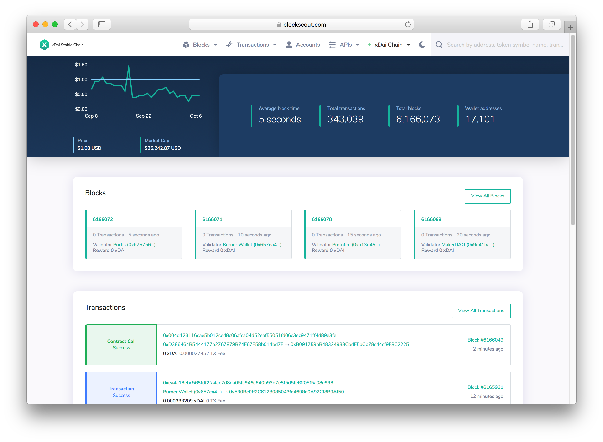

# Welcome to xDai

## About



XDAI is the ideal cryptocurrency for everyday payments and transactions. Fees are extremely low, payments are **instant**, and the value remains stable at ~ **$1 US Dollar per XDAI**. User friendly tools make XDAI easily adoptable for a broad audience \(crypto and non-crypto users alike!\)



The xDai chain is an EVM sidechain that uses a different consensus model \(currently [AuRa](https://wiki.parity.io/Aura) and moving to [POSDAO](for-validators/posdao-whitepaper.md)\) than Ethereum. The underlying architecture, however, mirrors Ethereum 1.0, meaning that smart contracts can be written and deployed in exactly the same way using a [different RPC endpoint](for-developers/developer-resources.md#json-rpc-endpoints).

Any contract that works on the Ethereum mainnet can be easily redeployed to the xDai chain. On the xDai chain, transaction costs are minimized, and all fees and transactions are paid with a single token, XDAI.



Validators on the xDai chain provide consensus for transactions and secure the chain. Current xDai validators are [well known organizations in the Ethereum community](for-validators/about-xdai-validators/), and are elected by other validators in an on-chain governance process.

When xDai switches to POSDAO and delegated Proof of Stake, anyone with enough STAKE and the ability to run a node will have the opportunity to become a validator. Delegators in this model will help determine the validator set by placing stake on candidates they want to see become validators.



xDai is the name of a blockchain and XDAI is the stable cryptocurrency used on the chain. Each XDAI token is worth ~ 1 US dollar.

The xDai blockchain is a sidechain of the Ethereum blockchain. It has the same properties as Ethereum, but uses a different consensus method to make sure transactions are valid and consistent across all nodes in the distributed network. By using known organizations \(called validators\) who transmit and verify blocks every 5 seconds, transactions can be completely quickly and fees for transactions can be minimized.

XDAI is a cryptocurrency created from the [MakerDAO DAI token](https://makerdao.com). DAI is a stable token on the Ethereum mainnet pegged to the US dollar. XDAI can be acquired by users in a number of ways \([for example with a credit card](for-users/buying-xdai-with-carbon/)\) but behind the scenes it is always created from DAI, and the value of XDAI always corresponds 1:1 with DAI. 

Here's how xDai is created:

1. DAI is locked into a smart contract on Ethereum. This means it must remain in that contract and cannot be moved until the contract receives a verified signal to unlock it.
2. Using a bridge mechanism called the [TokenBridge](https://docs.tokenbridge.net), data about the locked DAI is transmitted to a smart contract on the xDai chain.
3. The contract on the xDai chain creates the exact same amount of XDAI.
4. This XDAI is then usable on the xDai chain. Users only need to switch the chain their wallet is pointing to, and XDAI is available using the same Ethereum address.

When users want to exchange xDAI for DAI, the process happens in reverse. XDAI is burned \(destroyed\) in the xDai chain smart contract, and a verified signal is sent to unlock the exact same amount of DAI on the Ethereum mainnet. The unlocked DAI is then returned to the user’s address on the mainnet.



#### **The primary advantages of the xDai Stable Chain include:**

* ✅Fast transaction times \(5 seconds\)
* ✅Extremely low fees \(Transactions cost fractions of a cent\)
* ✅A single token for transactions & gas \(to conduct DAI transactions on the mainnet, you need ETH & DAI\)
* ✅A growing ecosystem designed to support stable person-to-person transactions and micro transactions.
* ✅Smart contract compatibility with other EVM chains.

The xDai chain currently runs with a group of designated validators who provide consensus for transactions. However, the xDai Stable Chain will be transitioning to a [delegated Proof of Stake model called POSDAO](for-validators/posdao-whitepaper.md) where validators and their delegators \(delegators can be any interested user!\) will earn rewards in return for providing collateral to protect the chain. We will provide updated information on this exciting transition as the time approaches.

