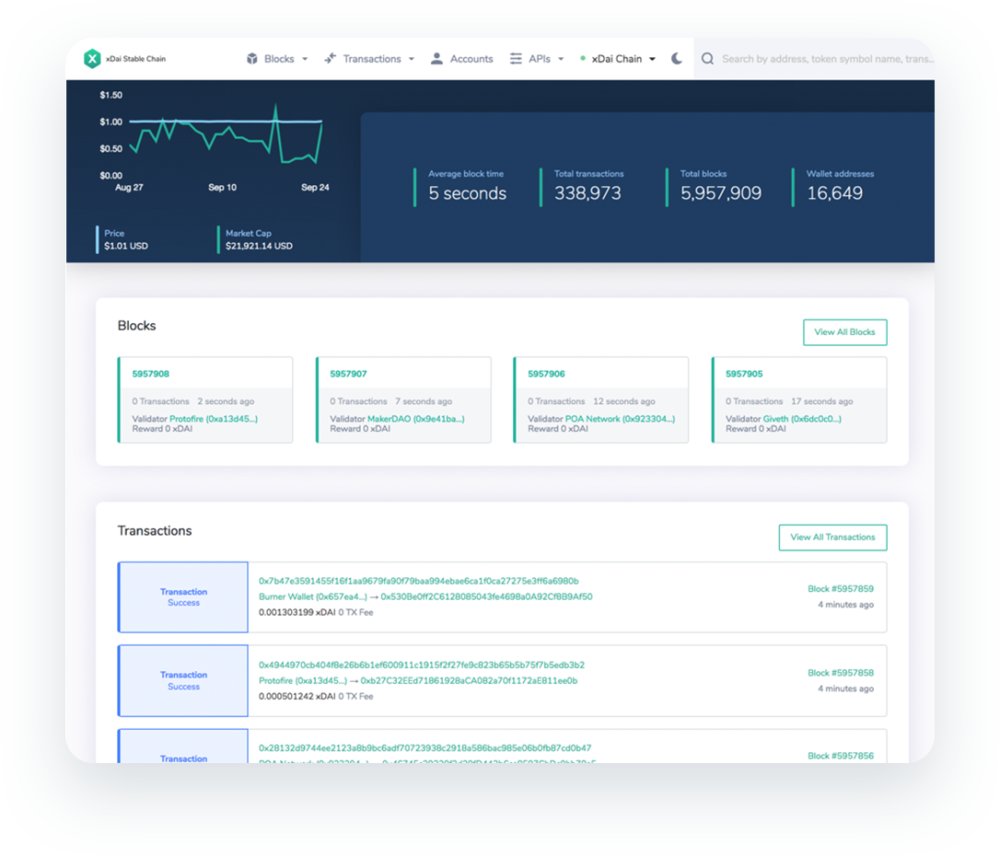

# Stable chain with xDai token

## xDai and the xDai Stable Chain

> xDAI is a cryptocurrency that is pegged to the US Dollar, has super low transaction fees, and fast transaction times. These features make it an ideal cryptocurrency to use for every day transactions like retail stores or peer to peer transfers.

xDai is the stable currency used for transactions on the xDai Stable chain. xDai is created  through the TokenBridge mechanism, where DAI is locked in a smart contract and the same amount of xDai is minted on the xDai chain. When a user bridges xDai back to DAI, the xDai is burned and the DAI is unlocked. For this reason, xDai’s value always corresponds 1:1 with DAI.

#### **The primary advantages of the xDai Stable Chain include:**

* ✅Fast transaction times \(5 seconds\)
* ✅Extremely low fees \(Transactions cost fractions of a cent\)
* ✅A single token for transactions & gas \(to conduct DAI transactions on the mainnet, you need ETH & DAI\)
* ✅A growing ecosystem designed to support stable person-to-person transactions and micro transactions.
* ✅Smart contract compatibility with other EVM chains.

The xDai chain currently runs with a group of designated validators who provide consensus for transactions. However, the xDai Stable Chain will be transitioning to a [delegated Proof of Stake model called POSDAO](https://docs.xdaichain.com/about-xdai/posdao-whitepaper) where validators and their delegators \(delegators can be any interested user!\) will earn rewards in return for providing collateral to protect the chain. We will provide updated information on this exciting transition as the time approaches.

