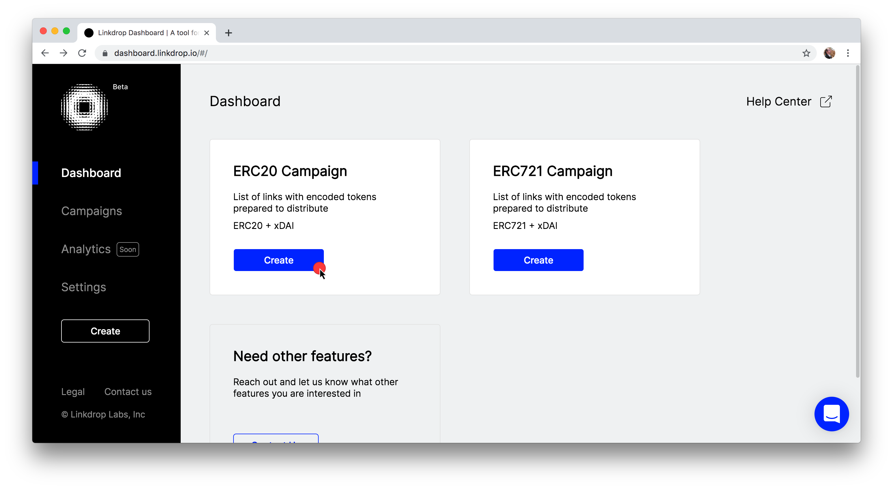
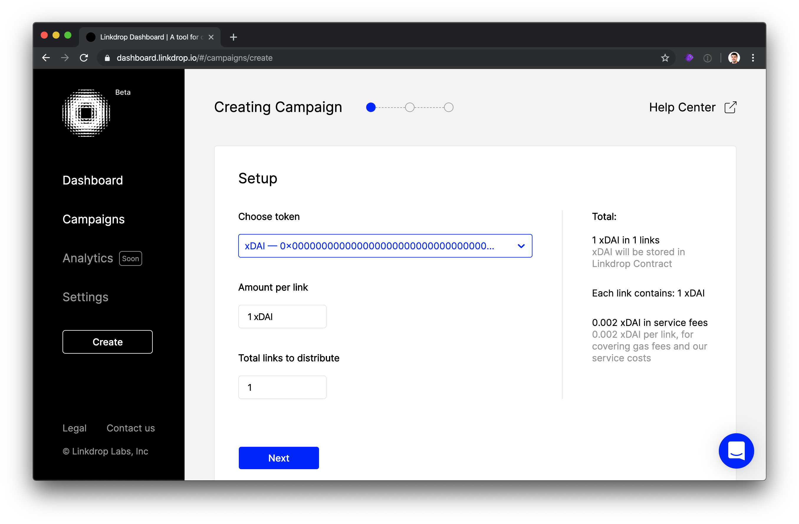
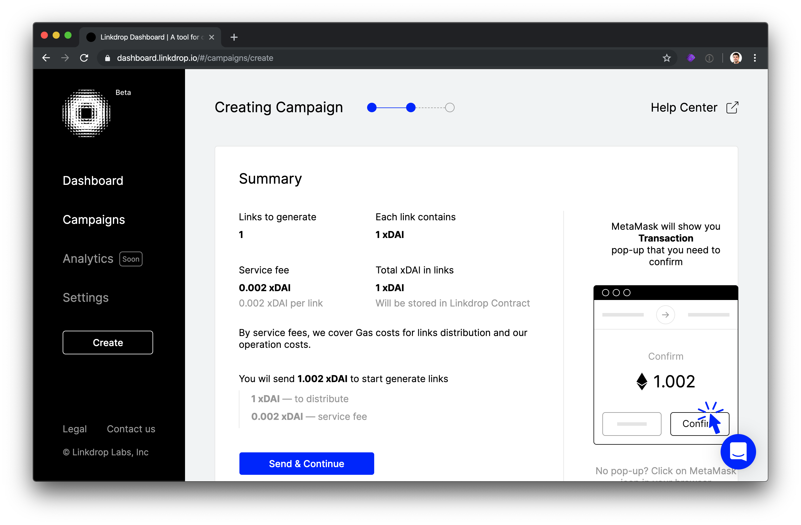
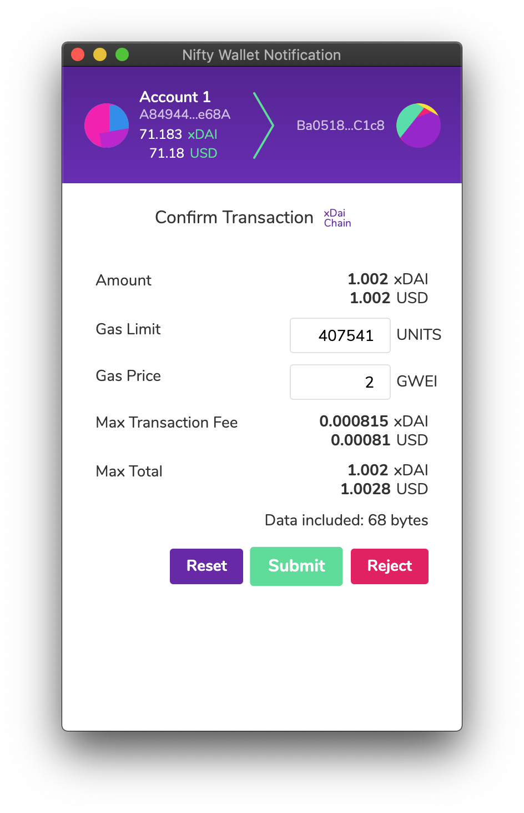
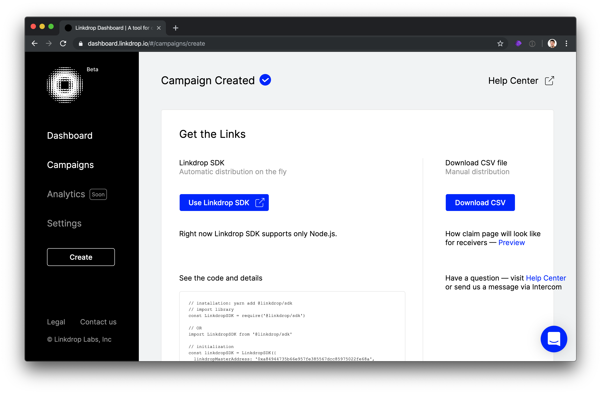
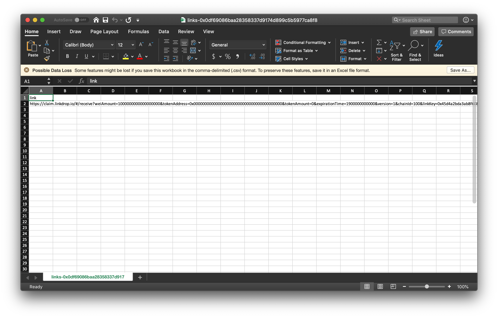

# Creating airdrops via Linkdrop

1\) Open the Linkdrop website  [https://dashboard.linkdrop.io/\#/](https://dashboard.linkdrop.io/#/) and connect your [Metamask to xDai](../../../for-users/wallets/metamask/metamask-setup.md).  To distribute xDai via an airdrop, select **ERC20 Campaign** and click **Create.**

2\) Choose the xDAI token, amount to distribute for each link, and total links to distribute, and click **Next**.

3\) The campaign summary will display. If correct, press **Send & Continue**. Otherwise, press the back button to change the parameters.

4\) A MetaMask window will pop-up to confirm the transaction. Click **Submit** to proceed.

5\) The Campaign is created. For a quick view of links, click the **Download CSV** button.

6\) Open the **CSV** to view and copy links.

7\) Links can now be sent as airdrops. Each link can be claimed once. 

**Generated link example:**

> [https://claim.linkdrop.io/\#/receive?weiAmount=1000000000000000000&tokenAddress=0x0000000000000000000000000000000000000000&tokenAmount=0&expirationTime=1900000000000&version=1&chainId=100&linkKey=0x45d4a2bda3ab8f608579284f1bcfe84fffd399b639ebf99fc69d0cb5a25cdc48&linkdropMasterAddress=0xa84944735b66e957fe385567dcc85975022fe68a&linkdropSignerSignature=0xc0a4e17b881f6ee254fc7a20caf3c648d3035e04bda167216482f9e41e71aab329abbe45e7502f30ceb2bf0408ce46f3111f42b11e3b2be3536c6f3fa72e32471c&campaignId=3](https://claim.linkdrop.io/#/receive?weiAmount=1000000000000000000&tokenAddress=0x0000000000000000000000000000000000000000&tokenAmount=0&expirationTime=1900000000000&version=1&chainId=100&linkKey=0x45d4a2bda3ab8f608579284f1bcfe84fffd399b639ebf99fc69d0cb5a25cdc48&linkdropMasterAddress=0xa84944735b66e957fe385567dcc85975022fe68a&linkdropSignerSignature=0xc0a4e17b881f6ee254fc7a20caf3c648d3035e04bda167216482f9e41e71aab329abbe45e7502f30ceb2bf0408ce46f3111f42b11e3b2be3536c6f3fa72e32471c&campaignId=3)


To claim, see the instructions for [getting airdrops via Linkdrop](../getting-airdrops/getting-airdrops-via-linkdrop.md).


