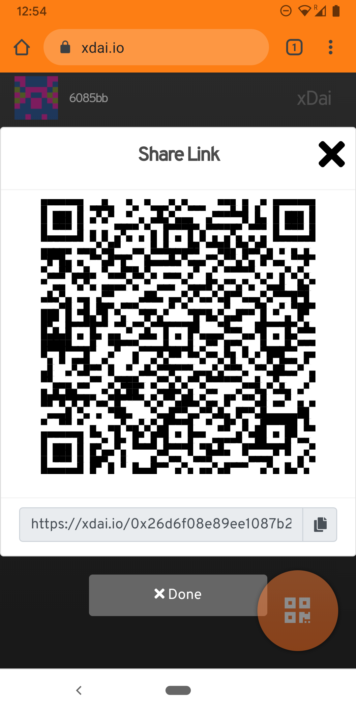
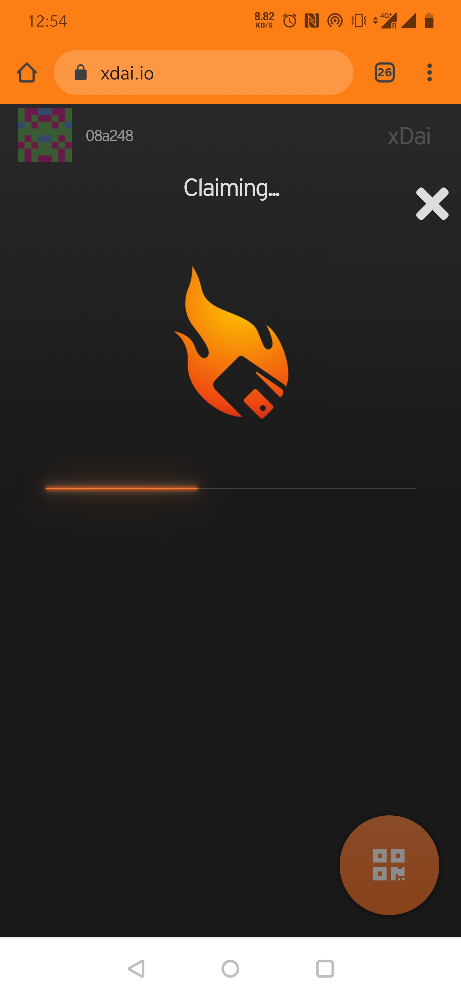

# Getting airdrops via Burner Wallet

### BurnerWallet airdrops: 


Please note that links used in the tutorial are already claimed



You do not need an existing Burner wallet to claim an airdrop. If you have not used BurnerWallet before, or do not have a stored local address, a new wallet address will be created when you scan the QR code or click the link.

If you do want to claim to an existing BurnerWallet address, **make sure your wallet \(**[at https://xdai.io](https://xdai.io)**\) is connected to that address before claiming the link.**

You can always send from a newly generated address to an existing address later.  


### Airdrops will either take the form of a QR code or a link.

A\) **QR code**

1. If you receive a QR code, you can scan from the BurnerWallet application at [https://xdai.io](https://xdai.io%20) or directly with your camera if using an iphone.

B\)  **Link**

1. Click on the link to claim the airdrop.  **Link Example:** [https://xdai.io/0x26d6f08e89ee1087b2fa6e562bb82c62ab767122773b0b23de27ab7e0c90c5f4;0x92013b2b62495dd18c3976b13da569b60d5cd252234f8c6ab709fb0aed71dd43](https://xdai.io/0x26d6f08e89ee1087b2fa6e562bb82c62ab767122773b0b23de27ab7e0c90c5f4;0x92013b2b62495dd18c3976b13da569b60d5cd252234f8c6ab709fb0aed71dd43)

#### Claiming

After clicking the link or scanning the QR code, your wallet will claim the amount and your balance will increase accordingly. 

