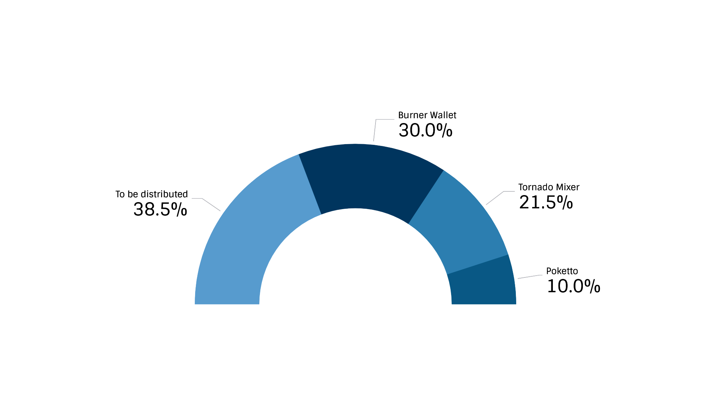

# Grants for building on xDai

## ZK \(Zero Knowledge\) Privacy Fund

A grant to fund ZK applications on xDai and other Layer 2 sidechains. ZK proofs offer the ability for users to make private transactions.

Why implement on xDai? Since xDai is a stable token, a primary use of the chain is peer-to-peer payments. Just as with cash, privacy should be an option when exchanging money or paying vendors for services. ZK protocols allow users to use xDai freely and anonymously.

To date, we have already distributed: 

* 30k Dai to Austin Griffith to implement ZK transactions in Burner Wallet
* 10k Dai to Poketto team to implement ZK transactions in Poketto Cash wallet
* 1.55mm POA \(~22k Dai\) to Tornado Cash team to deploy Tornado on xDai Chain

Applications are ongoing, you can learn more and apply here:  [https://forum.poa.network/t/introducing-the-poa-zero-knowledge-fund/2698](https://forum.poa.network/t/introducing-the-poa-zero-knowledge-fund/2698)

## xDai Adoption Fund

The xDai ecosystem is growing, and we are looking to fund DApps that bring new features, functionality and use-cases to the xDAi chain, as well as projects that provide enhancements to the current infrastructure. New features and applications are vital to increase adoption, and we provide financial support to interesting projects. Applications are available at the link below, please provide a thorough description of your project, how it will contribute to xDai's growth, and your projected funding requirements.

[https://poa950111.typeform.com/to/kvU6iQ](https://poa950111.typeform.com/to/kvU6iQ)

