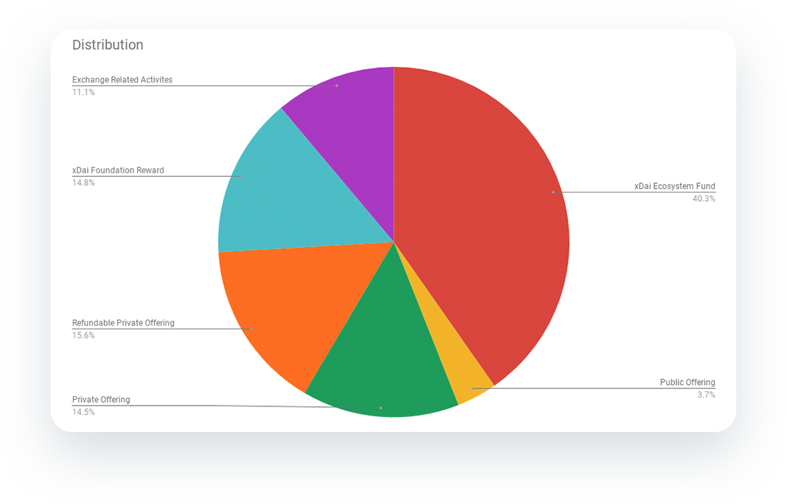

# Rounds, Prices, Distribution

### STAKE Supply and Distribution

The STAKE token has a fixed supply of 27,000,000. Of this amount, 9,118,977 \(~33%\) will be offered to investors. 

### Investor Funding Rounds


The xDai network upgrade to staking will take place 84 days \(12 weeks\) after the IEO, and the token release schedule is denoted in days following the IEO.


| Distribution Type | Amount | Initial Lock | Distribution Schedule |
| :--- | :--- | :--- | :--- |
| Private Seed Round | 1,408,451 | Partial | 25% released at IEO, 10% at day 28, remaining 65% distributed during the next 224 days |
| Private Offering Round | 2,500,000 | Partial | 25% released at IEO, 10% at day 28, remaining 65% distributed during the next 224 days |
| Private Offering Refundable Round | 4,210,526 | Partial | 15% released at IEO, 5% at day 28, remaining 80% distributed during the next 224 days |
| Public Offering \(IEO\) | 1,000,000 | Partial | 50% released at IEO, 50% at day 84 \(network upgrade date\) |

### Distribution

Tokens will be distributed according to a fixed schedule. Additional funding details:

* [Funding Token Release Schedule](funding-token-release-schedule.md)
* [Ecosystem Token Release Schedule](ecosystem-token-release-schedule.md)

