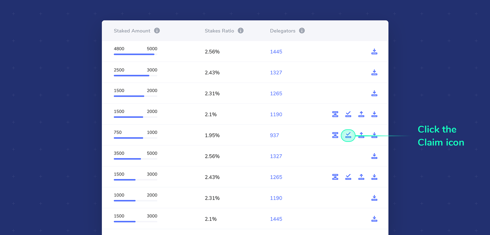
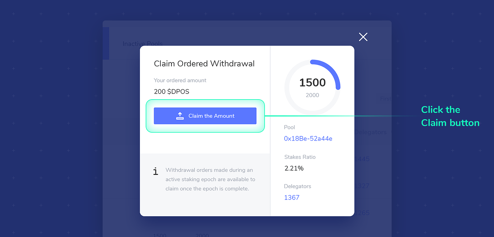

# Claim Stake


POSDAO Public Staking is not here yet \(anticipated Q4 2020\), but we are gathering documentation related to the xDai staking processes. All pages in this section are currently under construction. For staking available now, see [EasyStaking](../../easy-staking/)


Stake ordered for withdrawal is available to claim once the staking epoch in which the claim was ordered is complete. See the **important note below** related to actions that can cause a claim delay.

1. Check that your web3 wallet is connected with the correct address and you have enough xDai to process the transaction. 
2. Click the Claim icon next to the pool you would like to claim your stake from. The icon will only appear once a claim is available.  

3. The modal will show the amount available to claim. Click the **Claim the Amount** button.  

4. Confirm the transaction with your web3 wallet. The claimed amount will be added to your address balance.


**Important:** If you place a withdrawal order in a staking epoch **before claiming your previously ordered amount**, your initial claim will be carried over and added to the new order, so that **no amount will be available to claim from that pool until the beginning of the next staking epoch**.


**For example:**

* **Staking epoch 100:** 5 STAKE ordered for withdrawal.
* **Staking epoch 101:** 5 STAKE is available to claim. However, you place another order withdrawal for 7 STAKE before claiming the available 5 STAKE. The total ordered for withdrawal from the pool is now 12 STAKE. This new amount will be available in the next staking epochs.
* **Staking epoch 102:** 12 STAKE available to claim. This claim will continue to be available in subsequent staking epochs as long as another withdrawal order is not placed, which will delay claiming until the next staking epoch.

