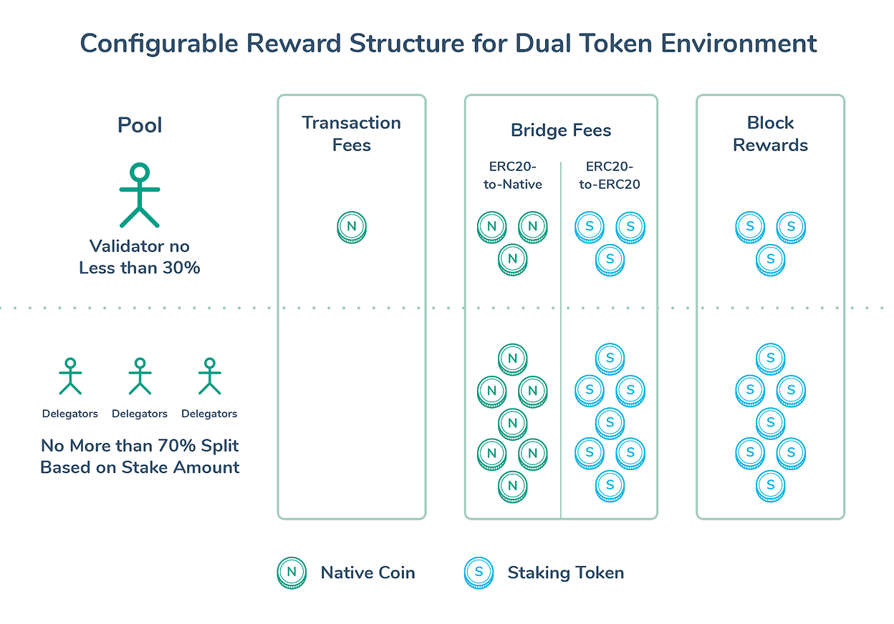
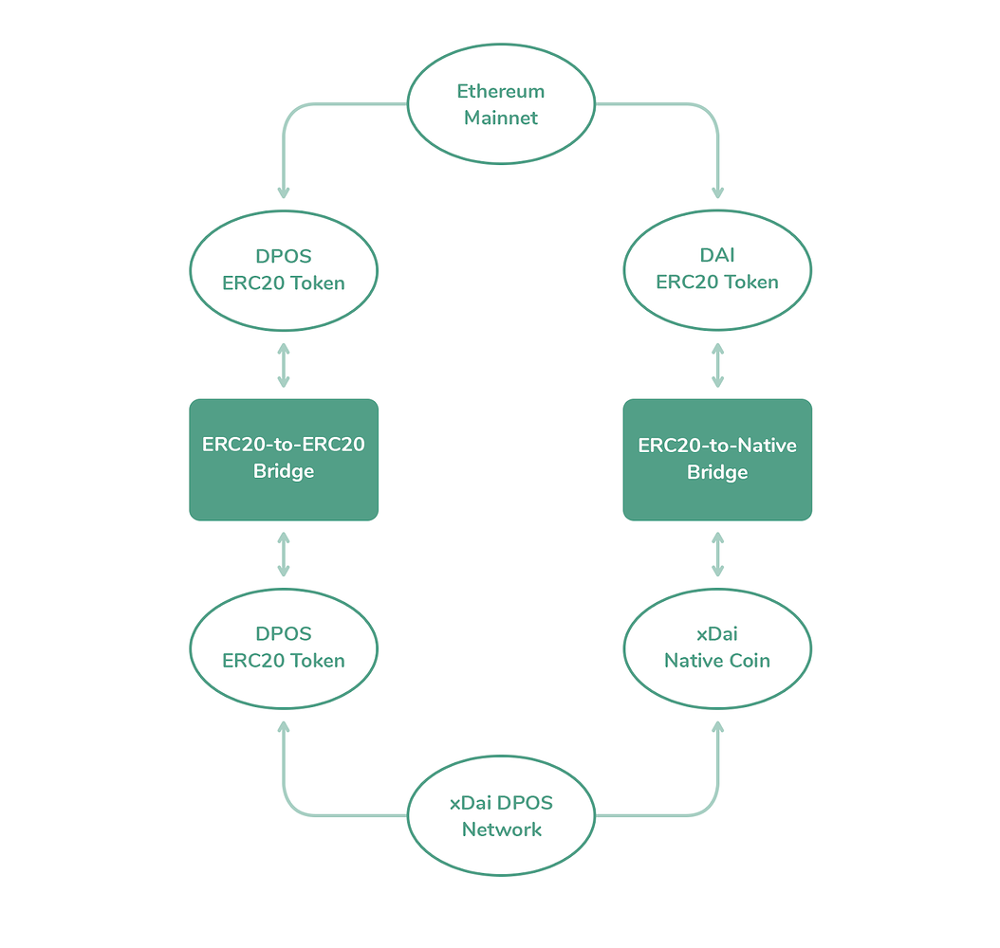
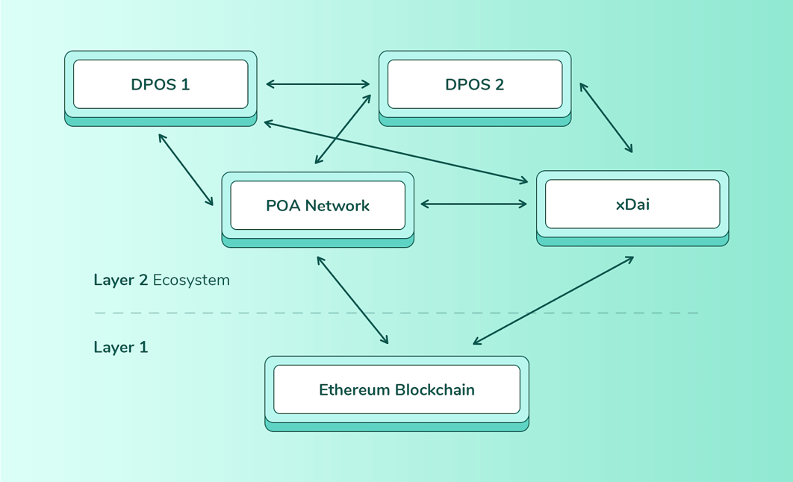

# Protocol Related Terms


POSDAO Public Staking is not here yet but we are gathering documentation related to the xDai staking processes. All pages in this section are currently under construction. For staking available now, see [EasyStaking](../../easy-staking/)




* [Aura Algorithm](protocol-terms.md#aura-algorithm)
* [Block/Bridge Rewards ](protocol-terms.md#block-bridge-rewards)
* [Bridge ](protocol-terms.md#bridge)
* [DPOS ](protocol-terms.md#dpos-delegated-proof-of-stake)
* [Emission Curve ](protocol-terms.md#emission-curve-emission-schedule)
* [Epoch ](protocol-terms.md#epoch-staking-epoch)
* [Epoch Number ](protocol-terms.md#epoch-number)
* [Fees](protocol-terms.md#fees)
* [Hard Cap ](protocol-terms.md#hard-cap)
* [Node ](protocol-terms.md#node)
* [Reward distribution rules ](protocol-terms.md#reward-distribution-rules)
* [Secret Number, Random number ](protocol-terms.md#secret-number-randomness-beacon)
* [Stake token ](protocol-terms.md#stake-token)
* [Technical Requirements ](protocol-terms.md#technical-requirements)
* [Withdrawal Rules ](protocol-terms.md#withdrawal-rules)



### AuRa Algorithm

AuRa stands for Authority Round. It is the underlying algorithm used by the xDai chain to ensure validators produce blocks in an honest and timely fashion. In AuRa, validators selected for each staking epoch take turns proposing blocks. A majority of validators in the current active set must agree a block is valid before it is finalized. For more information, see [https://openethereum.wiki/Pluggable-Consensus/\#aura](https://openethereum.wiki/Pluggable-Consensus/#aura)

There are plans to explore pluggable consensus options in future iterations of the xDai Stable Chain. This includes the Honey Badger BFT consensus; more information on Honey Badger is available here [https://forum.poa.network/c/posdao/hbbft](https://forum.poa.network/c/posdao/hbbft)

### Block/Bridge Rewards

Validators and their delegators receive rewards in exchange for securing the chain. **Rewards are divided equally among each validator pool participating in the current staking epoch**. After each staking epoch, reward funds collected by validator pools are available for validators and delegators to claim using the [claim function](../staking-operations/claim-stake.md). 

Within each pool, these rewards are further divided based on the reward.


Details of the reward mechanism process are subject to change as we fine tune the model. 


Rewards take two forms; block and bridge rewards.

* Block rewards are allocated in STAKE, and sent to the validator pool \(validators & delegators\) responsible for creating and signing a block. **Transaction fees in xDai are given to validators only \(not the validator pool\)**.
* Bridge rewards are collected whenever funds \(either xDai or STAKE\) are moved into or out of the chain. An entrance or exit fee may be charged, and this fee is equally distributed to all validator pools in the validator set which are active when the funds are bridged. Fee amounts are customizable through governance decisions and are currently TBD.

Reward funds collected by validator pools are distributed amongst the validator and the delegators according to the reward distribution rules at the end of each staking epoch.

STAKE is the staking token, and xDai is the Native Coin. The 70/30 Split rules are detailed in the [fees section](protocol-terms.md#fees).

### Bridge

TokenBridge instances are used to connect two chains to one another, allowing for asset conversion from 1 chain to the other. The basic mechanism involves bridge smart contracts which lock assets on one side and mint them on the other. When the assets are moved back across the bridge, they are burned and unlocked. Bridges have their own set of validators which monitor token transfers and a [governing board responsible for updates to the bridge and bridge parameters. ](../../../about-xdai/faqs/bridges-xdai-bridge-and-omnibridge.md#what-is-the-bridge-governance-board)

The xDai Stable Chain currently operates with two bridges:

1. **xDai Bridge**: An ERC20-to-Native Bridge where DAI may be converted to xDai and vice versa. When Dai is “bridged”, the specified amount of DAI is locked in a contract and a corresponding amount of xDai is minted on the xDai Stable chain. During this minting process, a TBD fee is collected for validators. For example, if the bridge fee is 1% and 100 DAI are “bridged”, 99 xDai are transferred to the user’s wallet and 1 xDai is equally distributed amongst the current validator pools\). When converted back, an exit fee may also be collected in the same manner. Any collected fees are distributed to validators and delegators at the end of a staking epoch. xDai Bridge link: [https://bridge.xdaichain.com/](https://bridge.xdaichain.com/)  
2. **OmniBridge** An all purpose ERC20 and ERC677 bridge where tokens on the Ethereum mainnet are converted to equivilant tokens on xDai. A fee may also be collected on entrance/exit and distributed to current validator pools. OmniBridge link: [https://omni.xdaichain.com/](https://omni.xdaichain.com/)

Future bridge implementations will extend the multi-staking capability of the STAKE token, allowing additional chains to use STAKE  as a staking token via bridge connections.

### DPOS \(Delegated Proof of Stake\)

Delegated Proof of Stake \(DPOS\) is an extension of Proof of Stake - a consensus model that provides rewards to chain validators in exchange for providing an amount of tokens as stake. This staking process incentivizes validators to act in the best interests of the network, as their stake will be impacted \(frozen\) if malicious behavior is detected.

To increase decentralization in this model and encourage wider community participation, the **DPOS model allows any token holders to deposit STAKE**. Delegators do this by placing stake on potential validator pools \(either current validators who may be elected to the next validator set, or candidates who are not currently validators\).

Delegators do not participate in block production themselves, but provide leverage to candidates they feel will make good validators. If these candidates are selected, rewards are divided amongst the validator and their delegators.

DPOS provides the opportunity for delegators to “vote” on potential validators by staking tokens on them. Candidates are incentivized to maintain a good reputation in order to attract more delegators and increase their chances of becoming validators. The POSDAO algorithm supports a DPOS model.

For more information on DPOS, see: [https://steemit.com/dpos/@dantheman/dpos-consensus-algorithm-this-missing-white-paper](https://steemit.com/dpos/@dantheman/dpos-consensus-algorithm-this-missing-white-paper)

### Emission Curve, Emission Schedule

The emission curve or schedule refers to the total amount of tokens that will be generated by a platform. The STAKE token will be released according to a [unique emission schedule](../../stake-token/stake-token-distribution/). 

xDai emission rates will not be determined by the protocol, as xDai correlates 1:1 with DAI, and the amount of xDai is always equal to the amount of DAI locked in the bridge smart contract.

### Epoch \(Staking Epoch\)

The time duration \(in blocks\) for which the validator set is selected. On the xDai Stable Chain AuRa implementation, each staking epoch lasts for 120992 blocks, which corresponds to a one-week timeframe with 5 second blocks. This value is configurable for other chains adopting the protocol.

### Epoch Number

The number of the current staking epoch. The staking epoch increments every 120992 blocks on the xDai chain. A new validator set is chosen for each epoch.

### Fees

Fees are collected from users of the xDai chain and divided amongst validator pools. Fees are charged for bridge events and transactions.

* **Bridge fees**: A transaction percentage fee may be charged whenever tokens are locked or unlocked in a bridge contract. Entrance and exit fees may be collected for both Dai &lt;-&gt; xDai transfers \(collected in xDai\) as well as STAKE \(mainnet\) &lt;-&gt; STAKE \(xDai chain\) transfers \(collected in STAKE\). Assessed bridge fees are split equally between validator pools active at the end of staking epoch. Fee percentages are determined through the [Bridge Governing Process](../../../about-xdai/faqs/bridges-xdai-bridge-and-omnibridge.md#what-is-the-bridge-governance-board).
* **Transaction Fees \(Gas fees\)**: Transaction fees are assessed for any xDai transactions such as sending xDai to another wallet or interacting with a smart contract. These fees are sent to the validator who seals the block in which the transactions take place \(transaction fees are not split among pool participants, they are only received by the validator\). Transaction fees on the xDai chain are extremely low. As an example, during EthDenver over 38,000.00 of transactions were cumulatively charged less than .20 in transaction fees.

### Hard Cap

The STAKE token is subject to limited distribution, and the hard cap describes the maximum amount that will be released to various entities.  [See additional information related to the release schedule](../../stake-token/stake-token-distribution/token-release-schedule.md).

### Node

Candidates and validators are responsible for maintaining a node capable of verifying transactions and storing the entirety of the chain. [A node must meet the technical requirements of the protocol](../../../for-validators/node-deployment/manual-non-aws-deployment.md).  A node must keep their version of the Blockchain client up-to-date and monitor the health of the node regularly. xDai with POSDAO will be supported by 2 clients, [OpenEthereum ](../../../for-developers/install-xdai-client/parity.md)and [Nethermind](../../../for-developers/install-xdai-client/nethermind.md).

### Reward Distribution Rules

Block rewards are shared by all validator pools participating in consensus. Rewards are distributed to validator pools according to the following rules:

1. Each pool within the validator set receives an equal share of the reward \(if all validators always produce blocks and don’t skip\) at the end of staking epoch. Skips will results in a lower reward share. If there are too many skips, [a validator pool can be banned](operational-terms.md#ban).
2. Pool rewards are distributed proportionally, as long as the total delegator’s stake is below 70%.
3. The validator is guaranteed to receive at least 30% of the pool reward. If the total delegator’s stake exceeds 70%, the delegators’ rewards are adjusted accordingly.

Rewards are tallied and stored in a smart contract as each block is closed, and are distributed at the end of each staking epoch.

Detailed examples are available in the POSDAO whitepaper. [POSDAO white paper](https://forum.poa.network/t/posdao-white-paper/2208)

### Secret Number, Randomness Beacon

The protocol implements a random number generator similar to ​RANDAO​, which is used to select a set of validators from the group of candidates at the start of each staking epoch. This number is used to add random variation to validator selection, although candidates with larger pools have a higher likelihood of selection to a validator set for each staking epoch \(candidates with higher stakes are probabilistically selected as validators for more staking epochs\).

This random number is generated by the current validator set during the staking epoch. Generation consists of several commits and reveal rounds, resulting in a cumulative process where entropy increases over the course of the epoch. If a validator skips revealing their secret number too often, or fails to reveal it in the last collection round \(which can influence selection for the next validator set\), they are treated as malicious and [banned](operational-terms.md#ban).

### STAKE token

STAKE is the staking token for the xDai Stable Chain. It is an ERC20 equivalent \(ERC677\) on the Ethereum mainnet, and an ERC20 equivalent \(ERC677\) when bridged to the xDai chain. STAKE can be obtained through various [centralized and decentralized exchange listings](https://www.coingecko.com/en/coins/xdai-stake).

### Technical Requirements

In order to run a node, certain technical requirements should be met. 

Minimal system requirements:

* OS: Ubuntu Linux 16.04 LTS with root or sudo-user access over ssh
* CPU: minimum 2 cores
* RAM: minimum 4GB
* Disk: SSD minimum 50GB
* Open network ports: SSH port \(default 22 TCP\), 30303 TCP/UDP. For security purposes, close other ports

**Running 2 nodes simultaneously**

In addition, we recommend each validator run two separate nodes simultaneously with different internet connections. This mitigates risk in the event a node goes down during the final reveal phase of a staking epoch. If this occurs, and there is no redundancy, the node is considered malicious and banned from the protocol.

To setup, the first node must have the ​engine\_signer​ option in a configuration.toml file, the second node should not have that option but should have the ​watchguard​ script which​ detects if the first node goes offline and sets the ​engine\_signer​ option for the second node \(see [https://github.com/poanetwork/posdao-test-setup/issues/39](https://github.com/poanetwork/posdao-test-setup/issues/39) for details\).

### Withdrawal Rules

Withdrawals are allowed during the [open staking window](operational-terms.md#staking-window).  

* **Only STAKE placed in the current staking epoch may be immediately withdrawn from a validator’s pool**. 
* An order for withdrawal can be placed on an active validating pool. The ordered amount can be claimed during subsequent staking epochs.
* Any amount of STAKE including the entire stake amount \(minus any stake currently ordered for withdrawal and not yet claimed\) can be withdrawn from an active candidate during the staking window.
* If an order for withdrawal has been placed, the amount can be changed during a staking epoch. To add an additional amount to withdraw, simply enter the additional amount. To withdraw a lower amount, enter a negative number to reduce the ordered amount. A transaction is created for each adjustment.
* Stake may be withdrawn during the open staking window from an inactive validator, as long as that validator is not banned. If banned, the banned until date will show the date when stake may be withdrawn from the pool.


See more details in the [Staking Operations -&gt; Withdraw Stake](../staking-operations/withdraw-stake.md) section.


