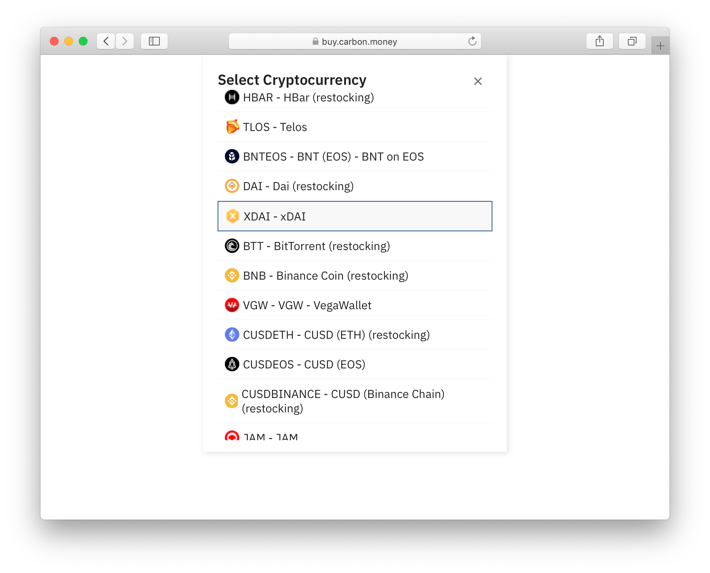
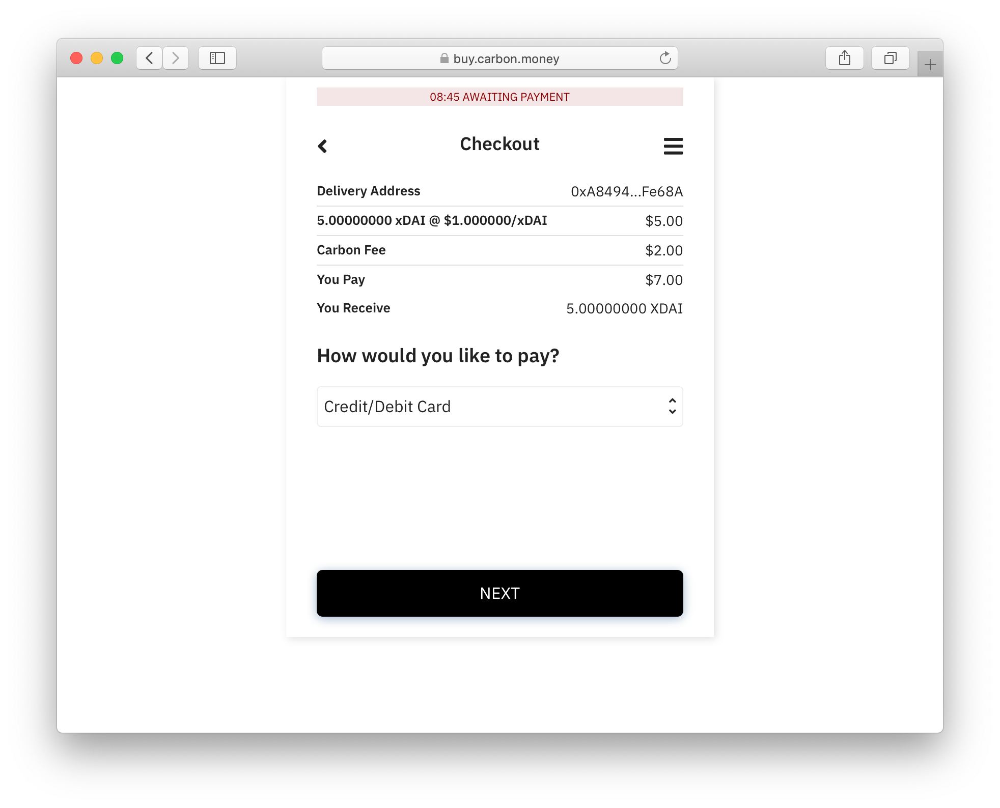
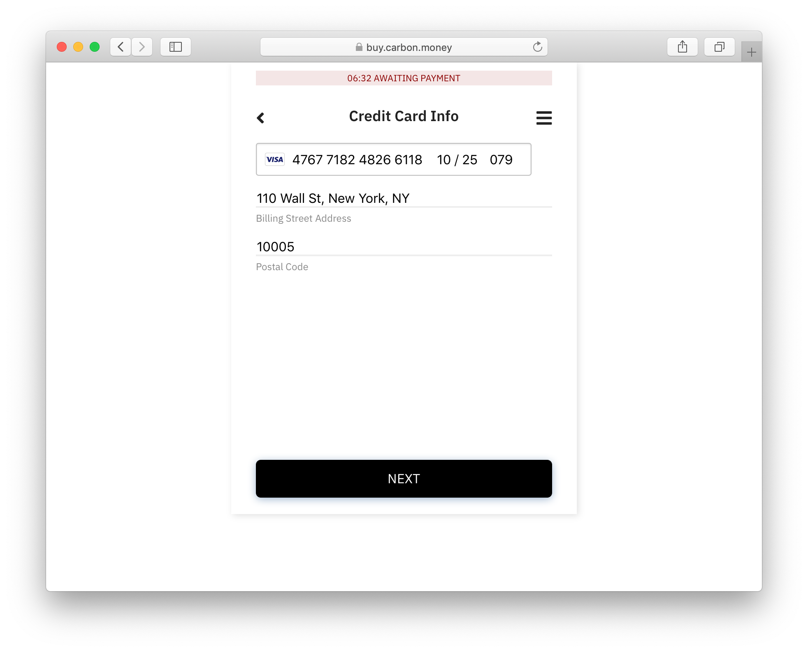
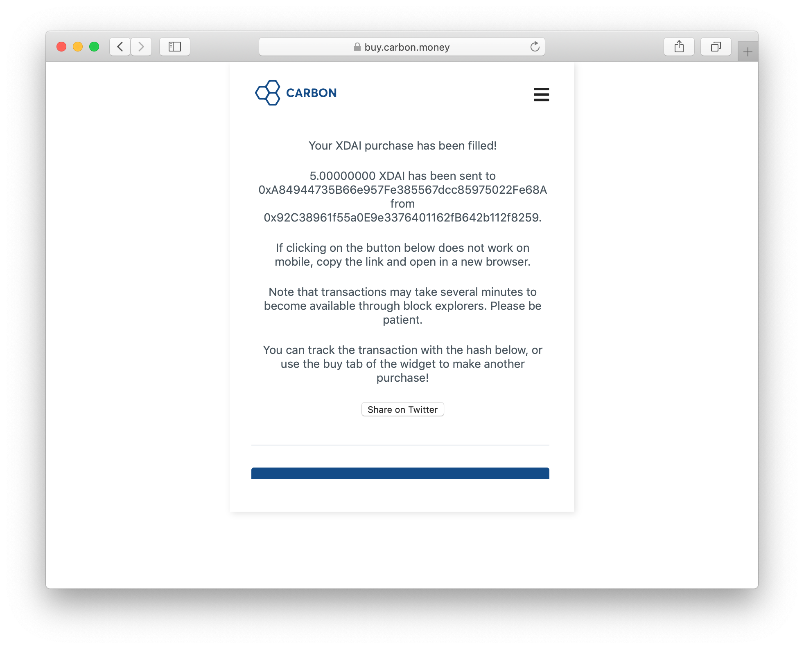
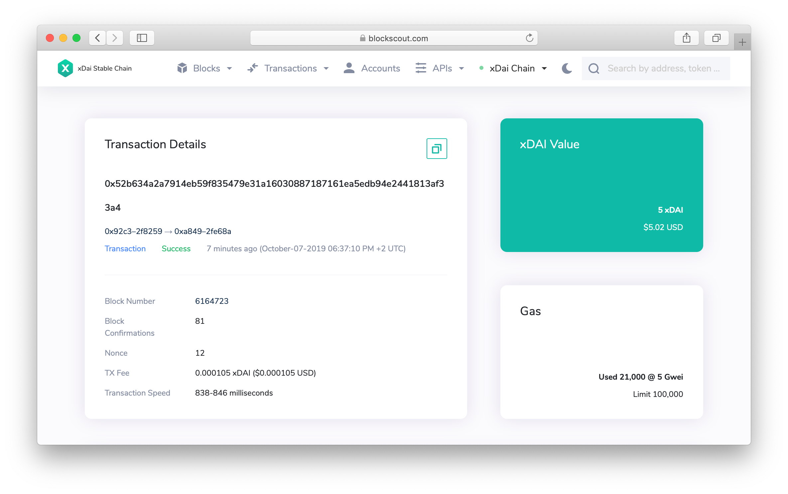

# Buying xDai with Carbon Widget


xDai direct purchases \(Carbon or Wyre\) are currently under construction.  Purchase Dai on the mainnet and use the [Bridge UI to get xDai](../converting-xdai-via-bridge/), or for an all-in-one exchange process you can use the[ Burner Wallet Exchange](../burner-wallet-functions/exchange-currencies.md).



Carbon's access is currently limited by certain geolocations based on IP address, including the US \(coming soon\). Here is a full list of restricted countries: [https://docs.carbon.money/docs/blocked-countries](https://docs.carbon.money/docs/blocked-countries).

Carbon is available now using an IP from a non-blocked country.


1\) Open the "Carbon" widget in your favorite browser [https://buy.carbon.money](https://buy.carbon.money/). 

2\) Select **xDai** from the **Select Cryptocurrency** drop-down. Type desired amount of xDai in the **Amount** input field.

#### Carbon Limits/ KYC \(Know-Your-Customer\) Policy:

* Minimum purchase amount: **$5 US**
* Maximum daily purchase **without KYC** \(no identity verification required\) : **$250 USD**
* Maximum daily purchase **with KYC** \(identity verification required\): **$2500 USD**

3\) In the **You pay** and **You receive** fields you will see the amount your card will be charged, Carbon's fees, and amount you will receive. Type **Next** and enter your xDai wallet address. 


xDai uses the same key derivation as Ethereum main network, which means **you can use the same addresses you use for your Ethereum account**. However, be sure that your wallet supports switching to the xDai network \(see supported wallets list or MetaMask instructions\).


4\) Enter your **e-mail address** and **phone number** in the corresponding fields. The service will ask you to type in a verification code. If you have [Authy](https://authy.com/) 2fa application installed for you number, you will receive the code in the app. If not, you will receive a text message with the code.

5\) Select **Credit/Debit Card** in "How would you like to pay?"  and press **Next**.


Before you enter your credit card details, we recommend looking into [privacy.com](https://privacy.com/home), which allows for private crypto transactions.  Also, it will generate one-time use cards that can protect your main card from possible leaks. Here is the reference [link](https://privacy.com/join/ME94Y) . Using the link, you will get $5 to spend anywhere online \(and me too\)!


6\) Type your **card details** and **billing address details** and continue with the payment.

7\) In a few seconds after pressing **Next**, you will get xDai straight to your wallet.

Here is the transaction from the instruction on BlockScout, the xDai blockchain explorer. Check out how fast and efficient it was to settle the transaction. [https://blockscout.com/xdai/mainnet/tx/0x52b634a2a7914eb59f835479e31a16030887187161ea5edb94e2441813af33a4/internal\_transactions](https://blockscout.com/xdai/mainnet/tx/0x52b634a2a7914eb59f835479e31a16030887187161ea5edb94e2441813af33a4/internal_transactions)

