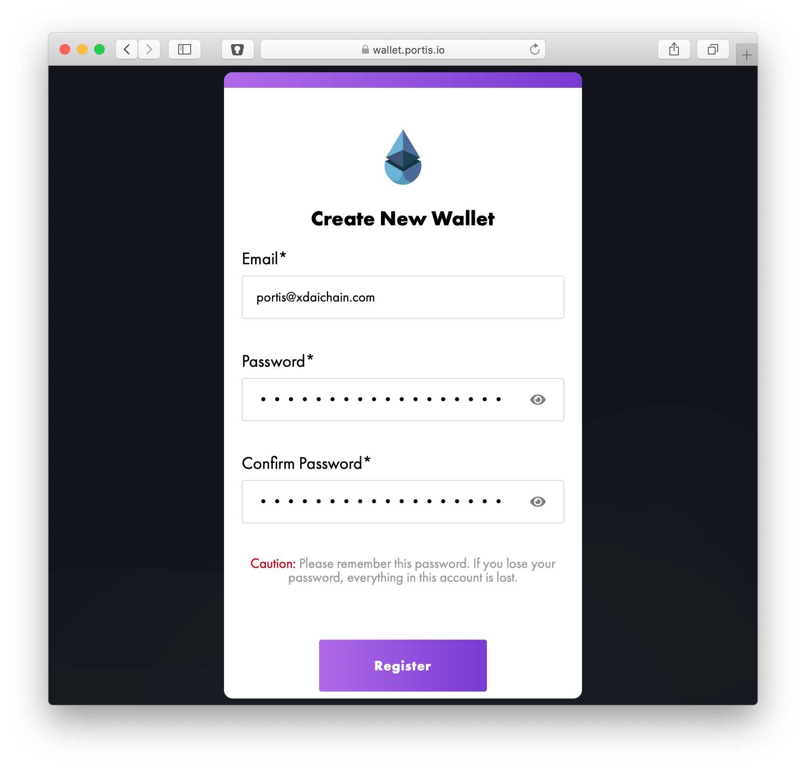
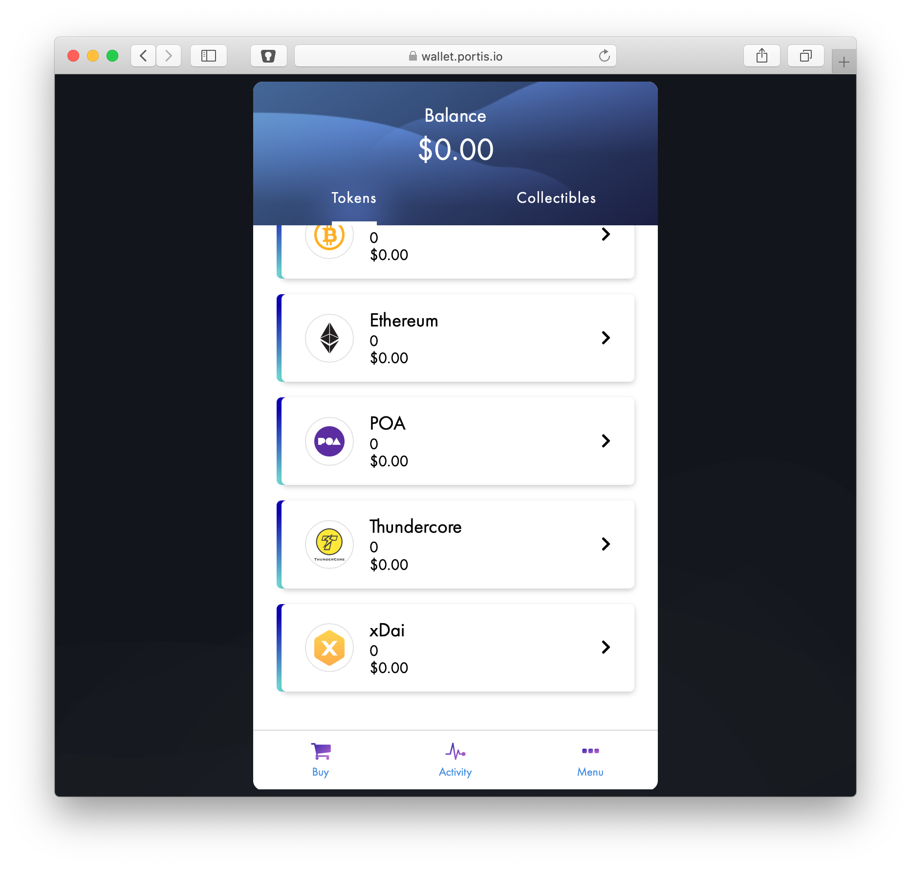
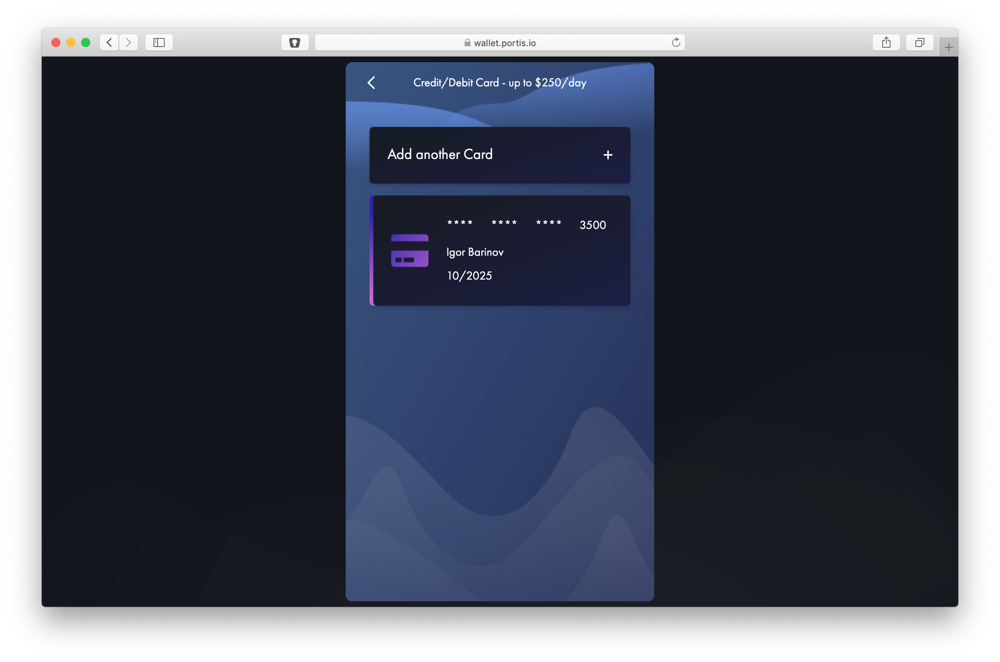
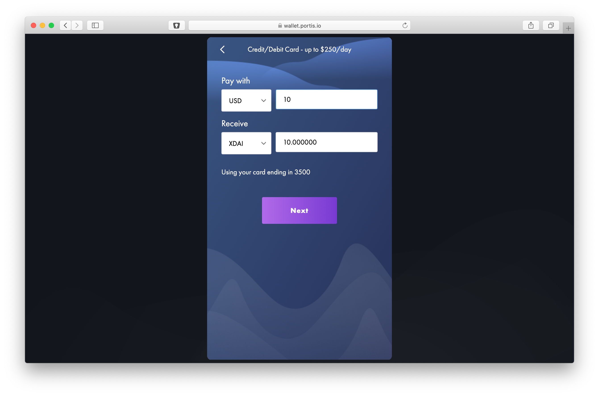
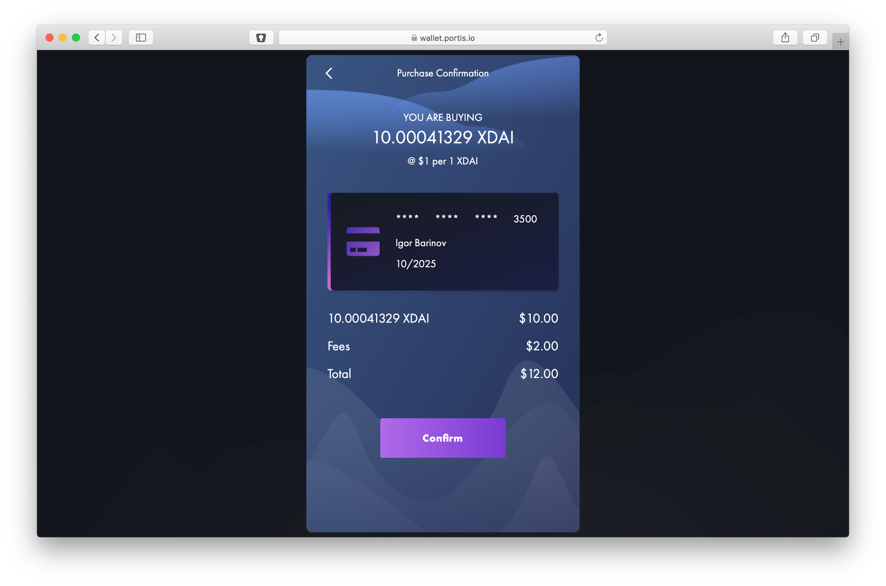
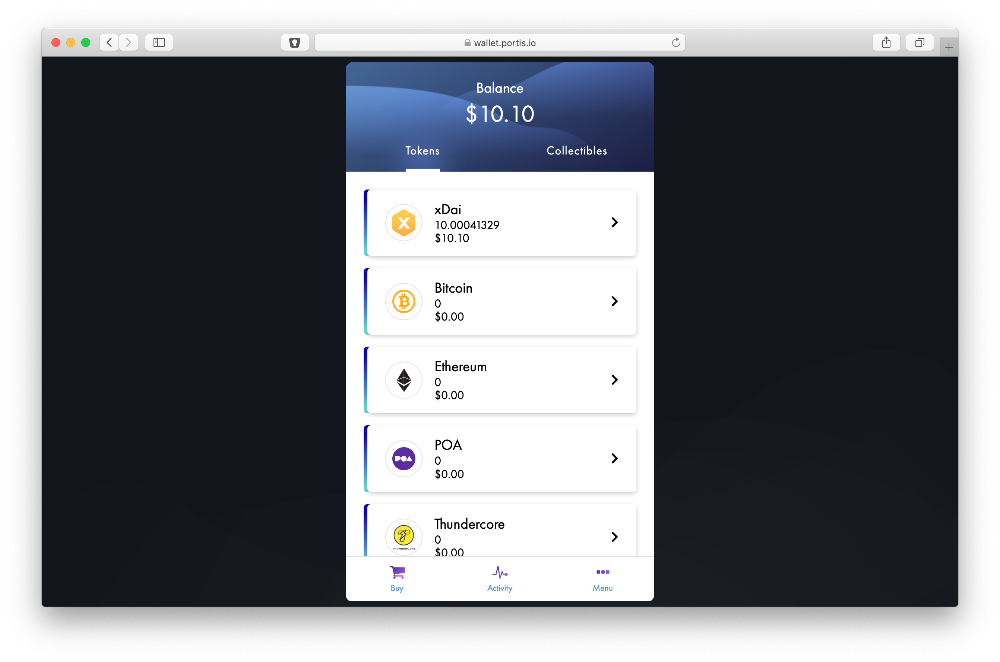
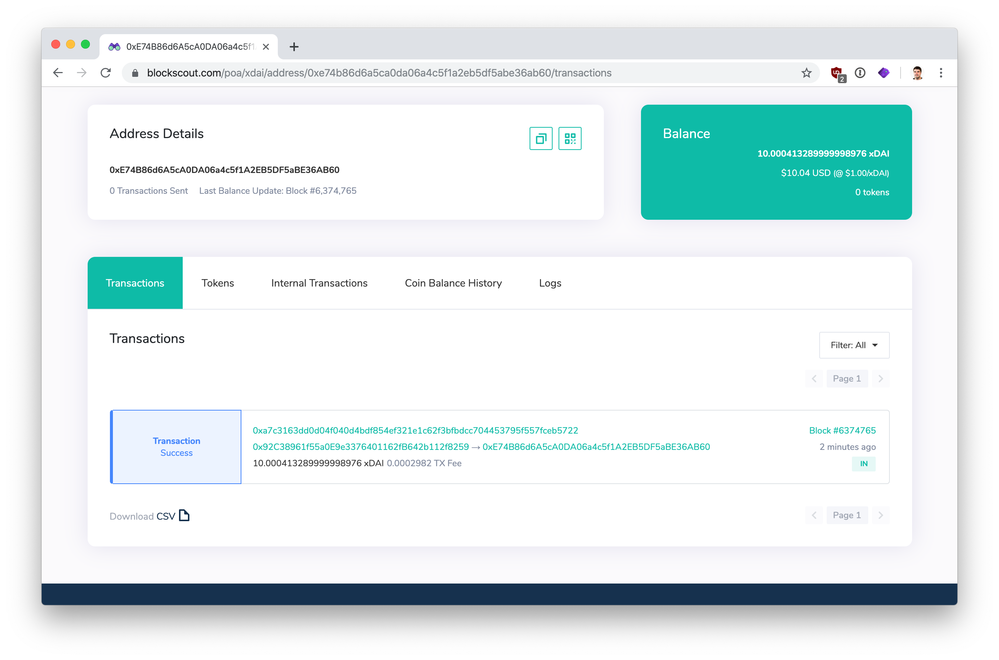

# Buying xDai with Portis via Carbon


If your billing address is located in the U.S., Wyre is used to purchase xDai via the Portis wallet. If outside the US, you will use [Carbon](../buying-xdai-with-wyre/buying-xdai-with-portis.md) to buy xDai in the Portis wallet.

With Carbon, up to $250 in xDai may be purchased per day without KYC verification. 


1\) Go to [portis.io](https://www.portis.io/) and click the **Get Started** button to create a new wallet \(or login to an existing wallet if you have one\).

2\) You will see xDai in the tokens list. Click on the **Buy** icon in the bottom menu. If you have not verified your email, you will be prompted to verify.

3\) Click to **Add a Debit or Credit Card.** Enter in your card details and click the **Add** button.


Up to $250 in xDai can be purchased per day without KYC on Carbon. 

Before you enter your credit card details, we recommend looking into [privacy.com](https://privacy.com/home), which allows for **private** crypto transactions.  Also, it will generate one-time use cards that can protect your main card from possible leaks. Here is the reference [link](https://privacy.com/join/ME94Y) . Using the link, you will get $5 to spend anywhere online \(and me too\)!


4\) Once your card is added and verified, you will see it in the list of cards. **Click on the card** to initiate an xDai purchase.

5\) Enter in the purchase type and amount, and click **Next**.

6\) Confirm details. You will see the exact amount of xDAi for purchase as well as the Carbon transaction fee. Click **Confirm** to complete.

6\) You will see the new amount reflected in your wallet. **Click on the xDai icon** to send xDai to another address or use for purchases.

7\) You can see the transaction record of this demo on BlockScout:

> [https://blockscout.com/poa/xdai/address/0xe74b86d6a5ca0da06a4c5f1a2eb5df5abe36ab60/transactions](https://blockscout.com/poa/xdai/address/0xe74b86d6a5ca0da06a4c5f1a2eb5df5abe36ab60/transactions)

