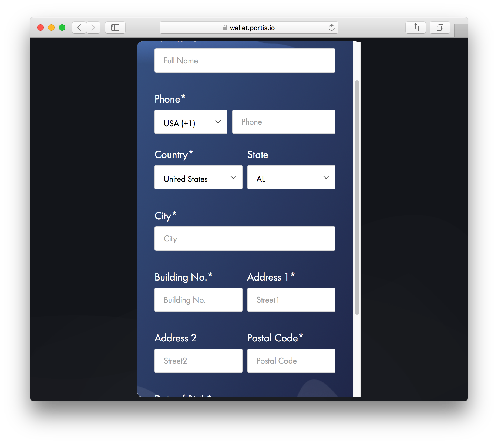
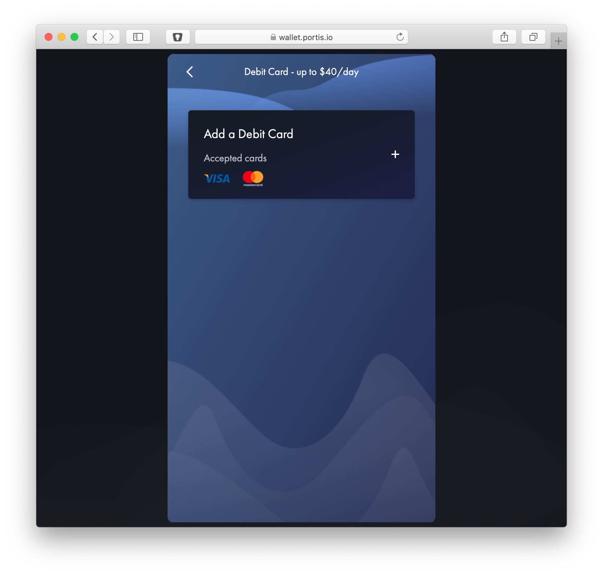
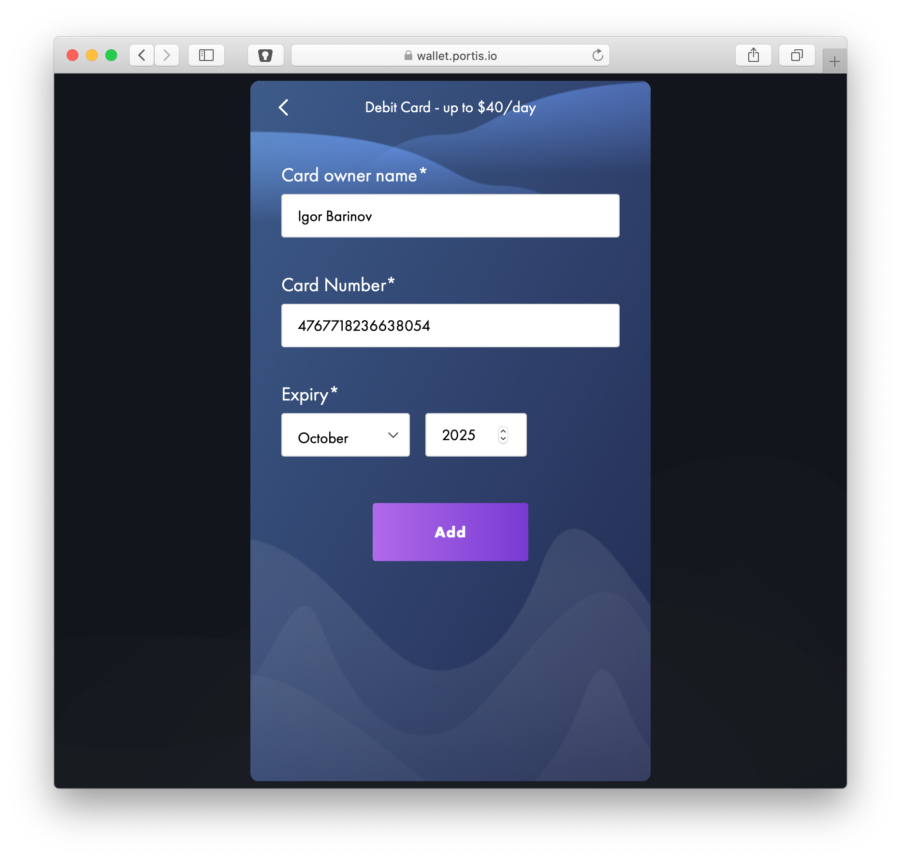
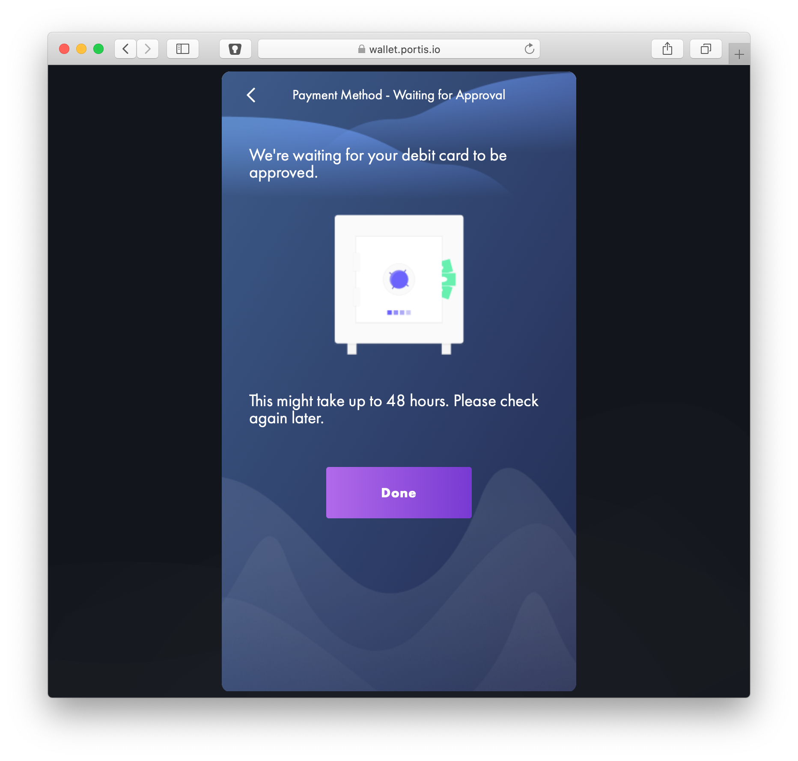

# Buying xDai with Portis via Wyre \(Under Construction\)


xDai direct purchases are currently under construction.  Purchase Dai on the mainnet and use the [Bridge UI to get xDai](../converting-xdai-via-bridge/), or for an all-in-one exchange process you can use the[ Burner Wallet Exchange](../burner-wallet-functions/exchange-currencies.md).



Billing addresses in the US use the [Wyre](https://www.sendwyre.com/) API to purchase xDai with Portis. US buyers are limited to **$40 per day** and pay a fee of ~3%.  


1\) Go to [portis.io](https://www.portis.io/) and click the **Get Started** button to create a new wallet \(or login to an existing wallet if you have one\).

2\) You will see xDai in the tokens list. Click on the **Buy** icon in the bottom menu. If you have not verified your email, you will be prompted to verify.

3\) Enter your details in the required fields. These are not needed for crypto wallet functionality, but are required for xDai purchases.

4\) You will be sent an SMS code. Enter it into the interface.

5\) Click to **Add a Debit Card.**

6\) Enter in your card details and click the **Add** button.


It may take up to 48 hours for approval.


