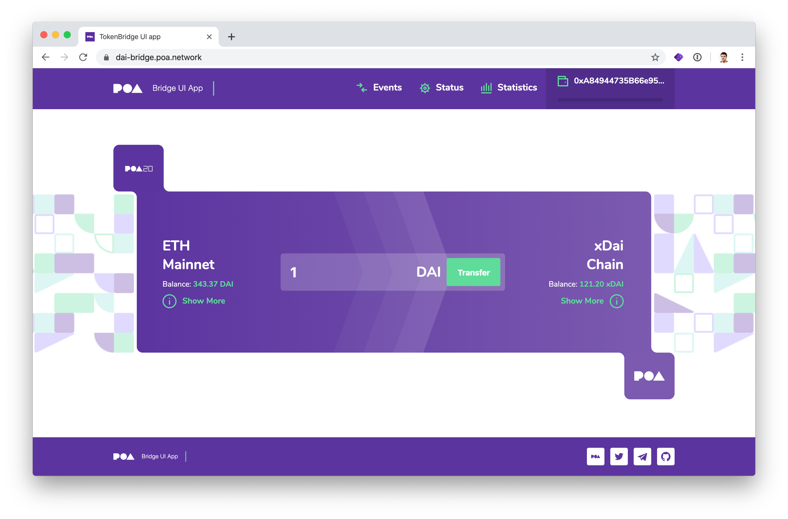
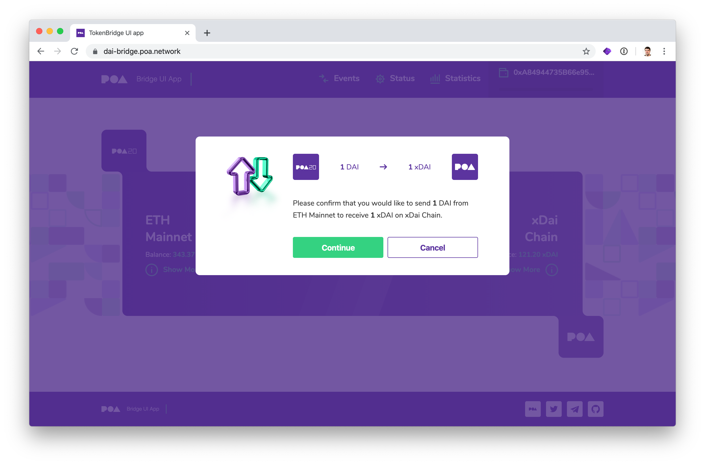
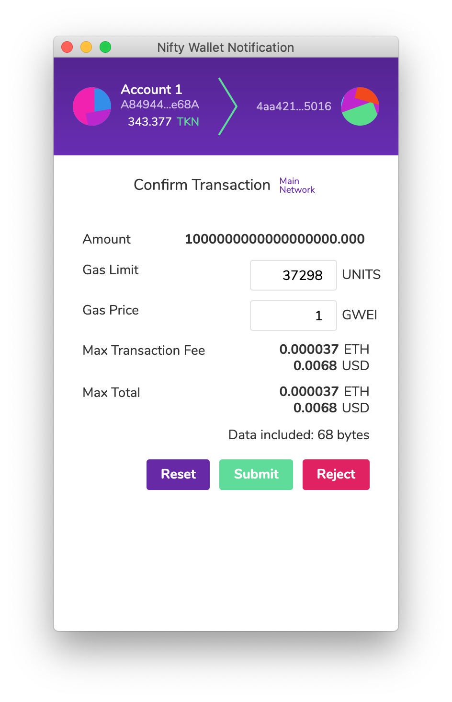
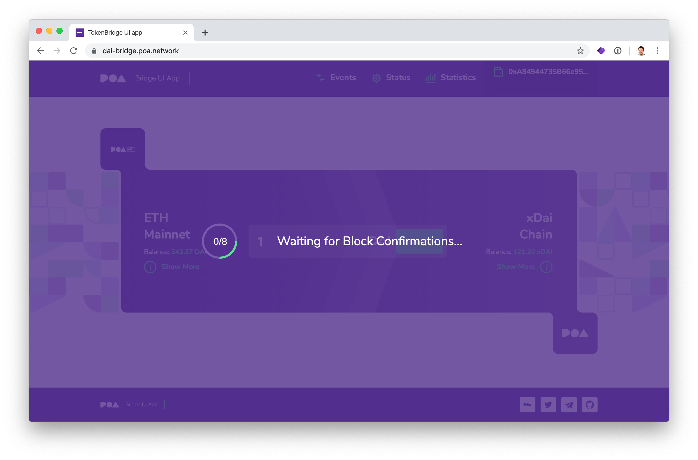
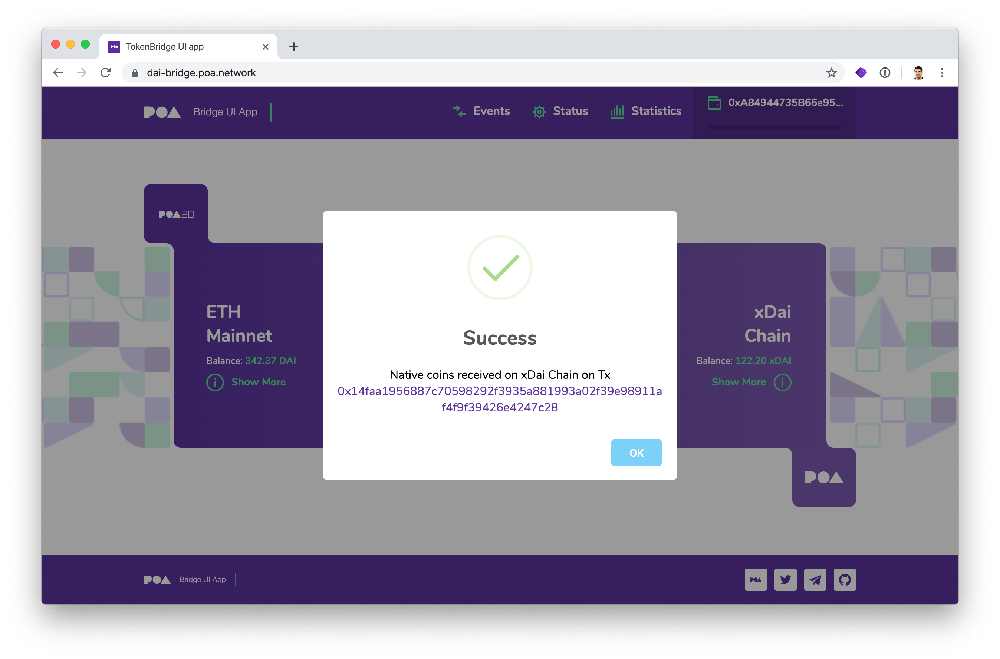

# Moving Dai to xDai

Check out transaction on BlockScout [https://blockscout.com/poa/dai/tx/0x14faa1956887c70598292f3935a881993a02f39e98911af4f9f39426e4247c28](https://blockscout.com/poa/dai/tx/0x14faa1956887c70598292f3935a881993a02f39e98911af4f9f39426e4247c28)


If you are interested in converting Dai to xDai without UI please check out an instruction [How to use xDai Bridge without UI](https://docs.tokenbridge.net/xdai-bridge/how-to-use-xdai-bridge-without-ui) 


