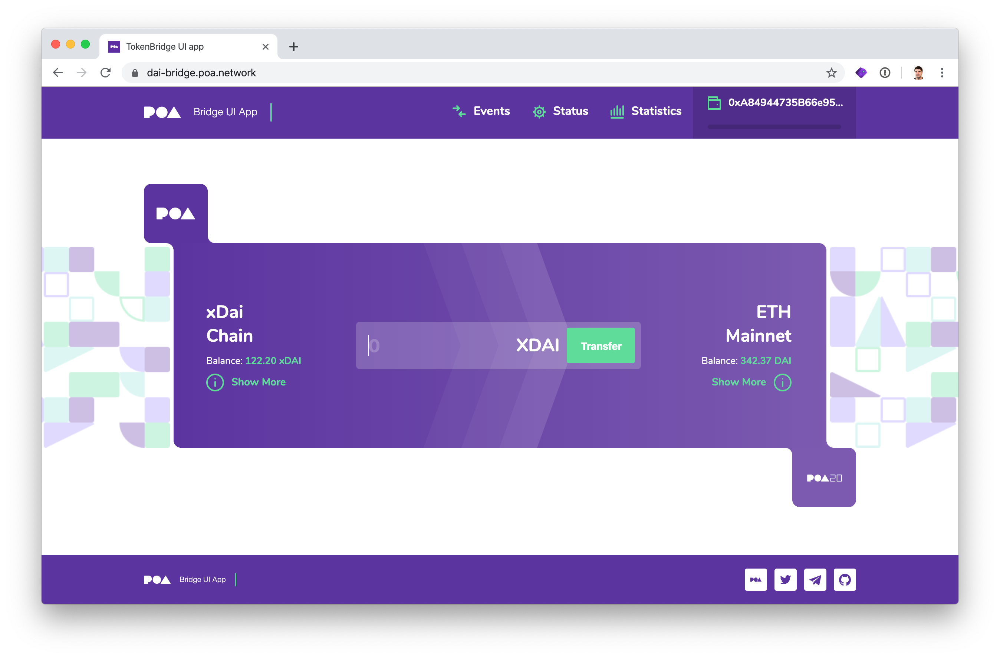
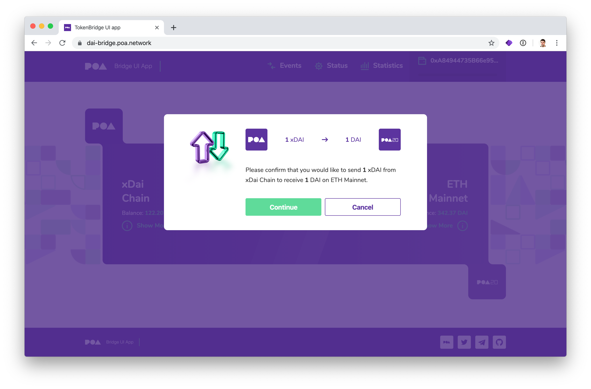
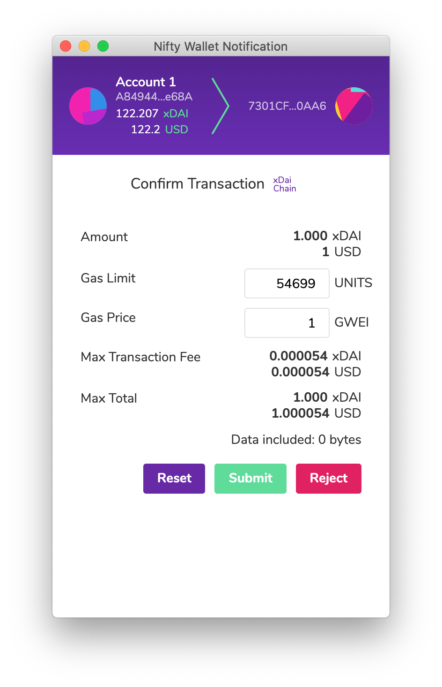
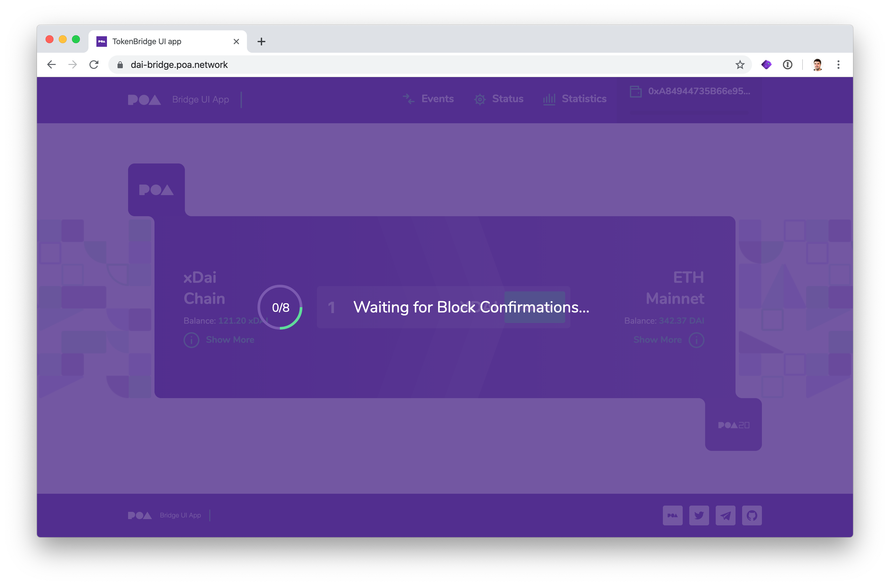
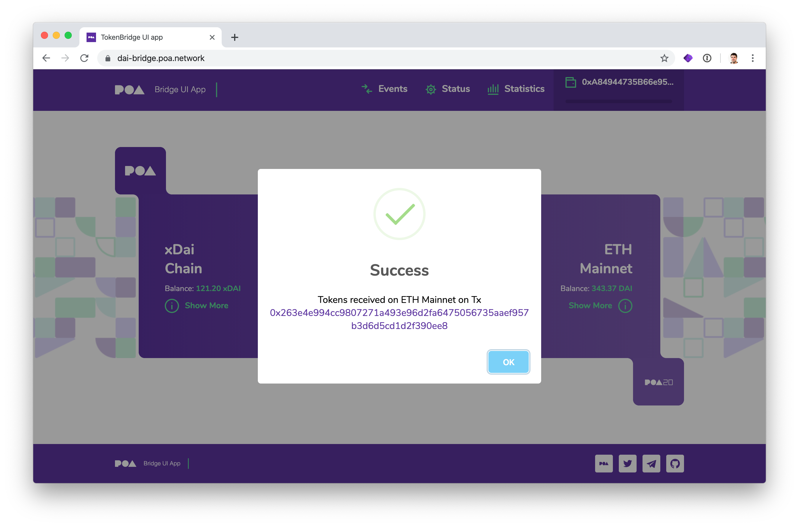
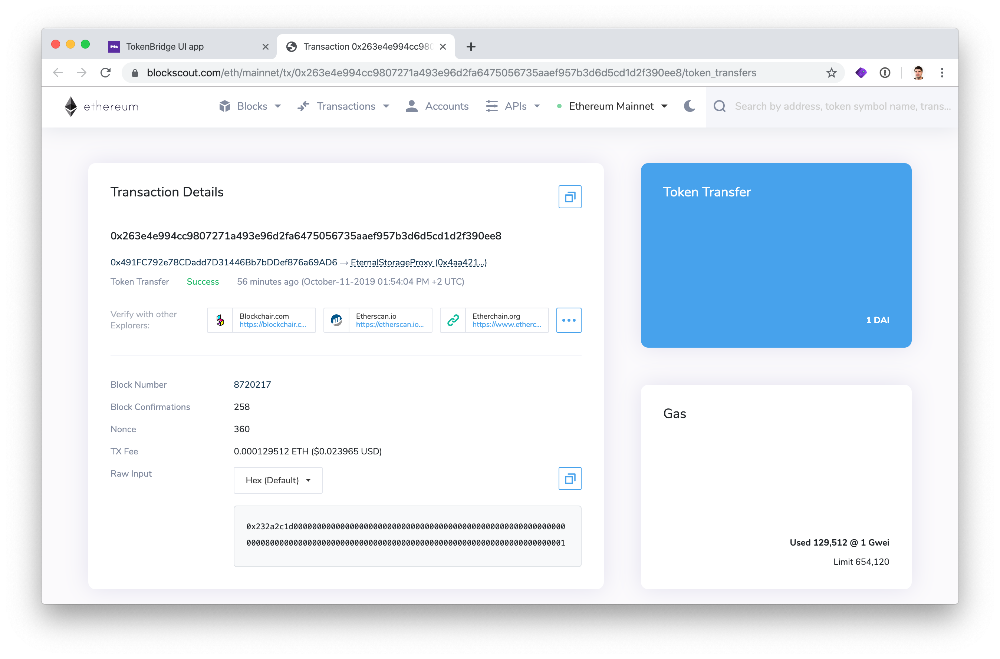

# Moving xDai to Dai

1\) Go to [https://dai-bridge.poa.network](https://dai-bridge.poa.network). [Connect your web3 wallet](../wallets-setup/metamask-setup.md) \(MetaMask, Nifty Wallet\) to the **xDai Chain**. Once connected, you will see your address populated in the header, and your xDai and Dai balance displayed on the page. 


You will need a small additional amount of xDai to process the transaction \(less than .0001!\)


2\) Enter the amount of xDai you would like to transfer to Dai, and click the **Transfer** button.

3\) A confirmation window will appear. Click **Continue.**

4\) The web3 wallet window will open with transaction details. Click **Submit or Confirm** \(depending on wallet\) to process the transaction.

5\) Wait for the transaction to process. Transaction will be confirmed in 5 seconds, but the relay confirmation takes additional time \(depending on the number of chain validators and the mainnet network throughput\).

6\) Success! xDai has been transferred to Dai and is available for use on the Ethereum mainnet.

Click the transaction hex to view your transaction. Check the result of the example transaction here: [https://blockscout.com/eth/mainnet/tx/0x263e4e994cc9807271a493e96d2fa6475056735aaef957b3d6d5cd1d2f390ee8/token\_transfers](https://blockscout.com/eth/mainnet/tx/0x263e4e994cc9807271a493e96d2fa6475056735aaef957b3d6d5cd1d2f390ee8/token_transfers)


If you are interested in converting Dai to xDai without the UI see [how to use xDai Bridge without UI](https://docs.tokenbridge.net/xdai-bridge/how-to-use-xdai-bridge-without-ui) 


