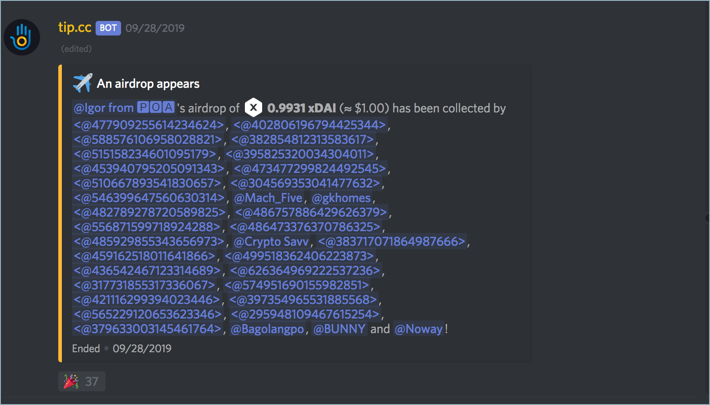
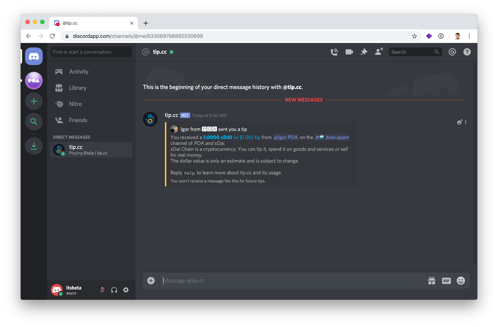
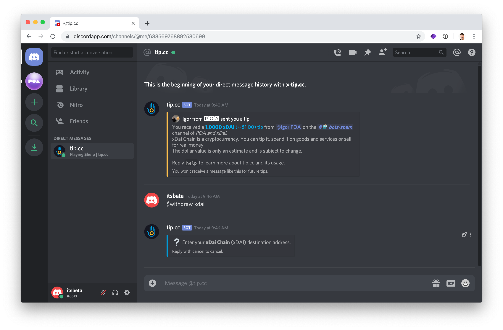
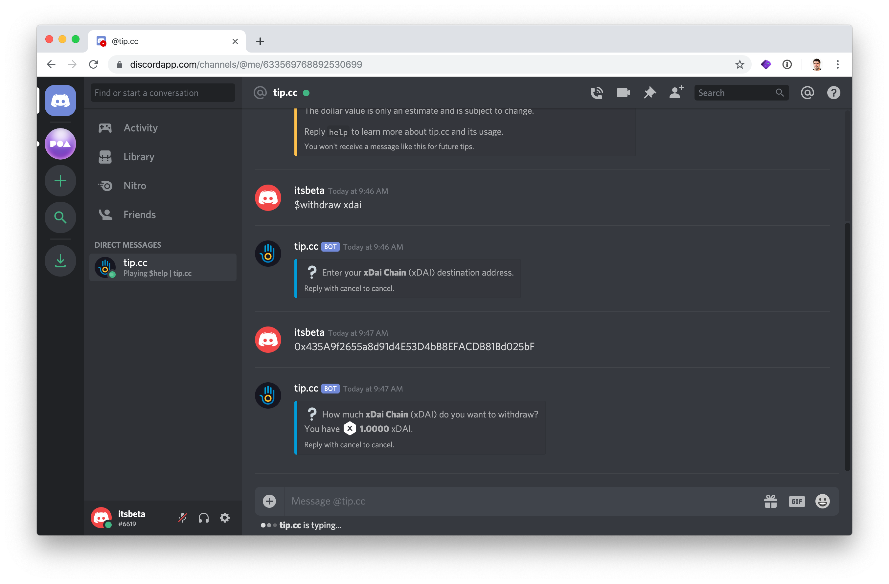
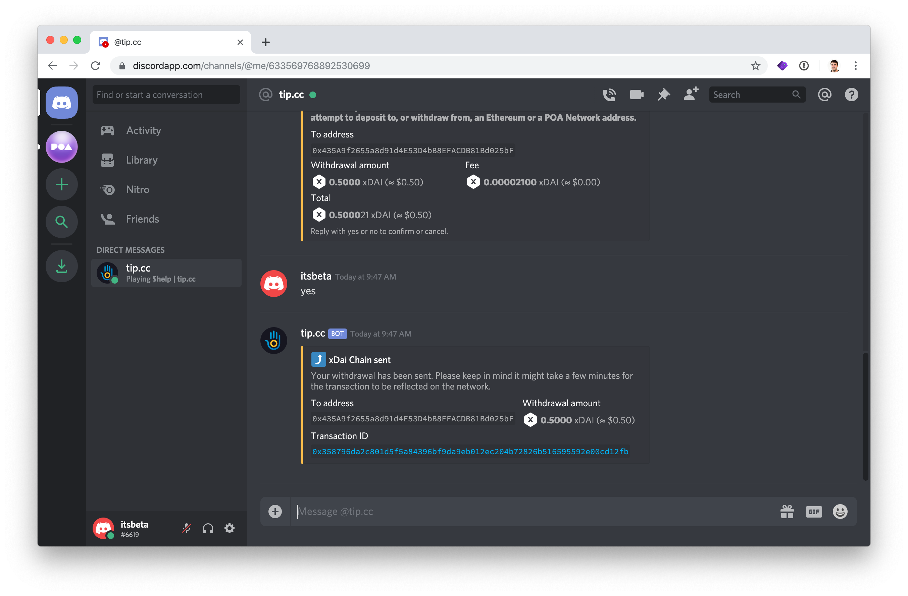
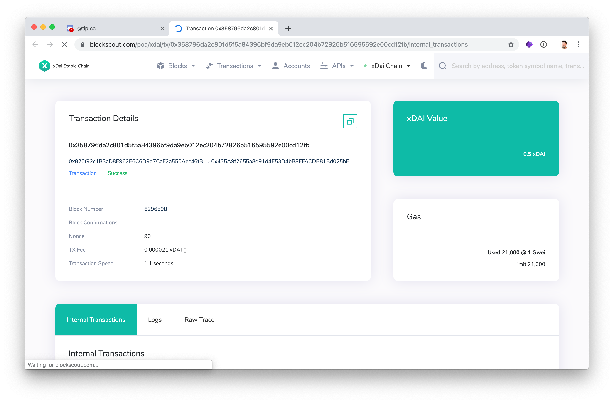

# Getting airdrops via Discord

### Receive an Airdrop

1\) Go to Discord \([https://discordapp.com/](https://discordapp.com/)\) and open the **POA and xDai** discord server. If you have not visited before, the invite link is [https://discord.gg/mPJ9zkq](https://discord.gg/mPJ9zkq)

2\) Visit the **\#**🍸 **drops** channel under the **Games** heading.

3\) When an airdrop appears, claim a portion by responding with the 🎉 icon. Depending on the airdrop parameters, the drop will last for a variable period of time and may include a different amount or type of currency.

### Withdraw an Airdrop

1\) Go to Discord \([https://discordapp.com/](https://discordapp.com/)\) and open the **POA and xDai** discord server. 

2\) Create a direct message with the [tip.cc bot](https://top.gg/bot/617037497574359050). You will see the bot in the top right of the web interface \(if not, activate member list above\). **Right click** and select **Message** to start a direct message.

3\) A direct message window will open. 


Useful tip.cc commands:

General info: **$help**  
Check balances: **$balances**


4\) Start a withdrawal with the `$withdraw xdai` command. If withdrawing a different currency, use that currency instead. \(ie `$withdraw poa` \)

5\) Enter the wallet address where you would like to send the funds.

6\) **Enter the amount**. You will see a confirmation message which includes the address, withdrawal amount and fee. Enter `yes` to complete the transaction.

7\) Withdrawal is confirmed, and funds are sent to the wallet of your choice. To check the transaction, click on the **Transaction ID** to view in BlockScout.

**Example transaction:** [https://blockscout.com/poa/xdai/tx/0x358796da2c801d5f5a84396bf9da9eb012ec204b72826b516595592e00cd12fb/internal\_transactions](https://blockscout.com/poa/xdai/tx/0x358796da2c801d5f5a84396bf9da9eb012ec204b72826b516595592e00cd12fb/internal_transactions)

