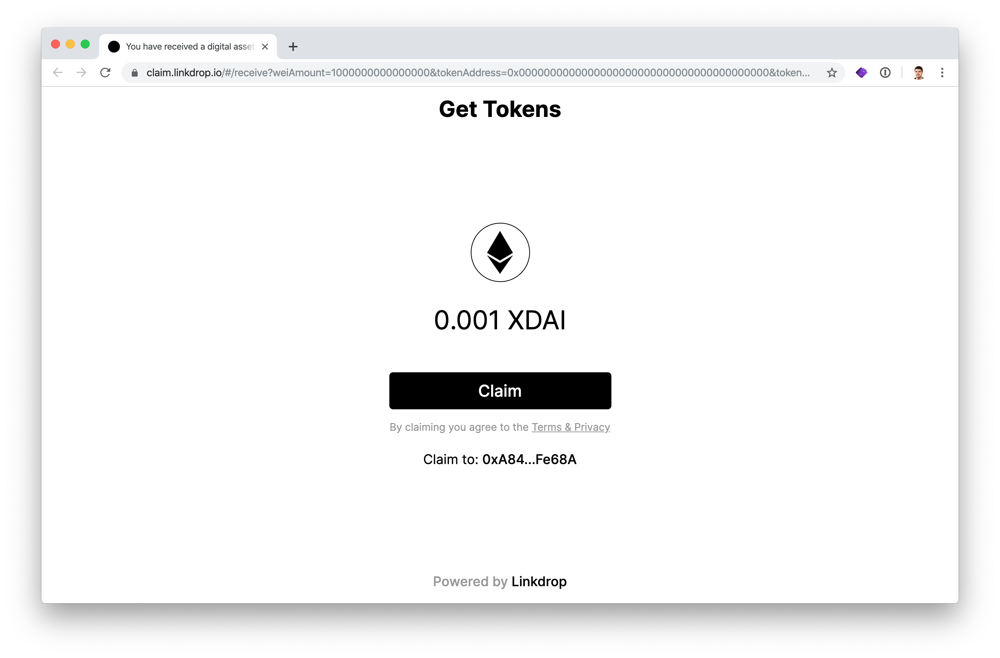
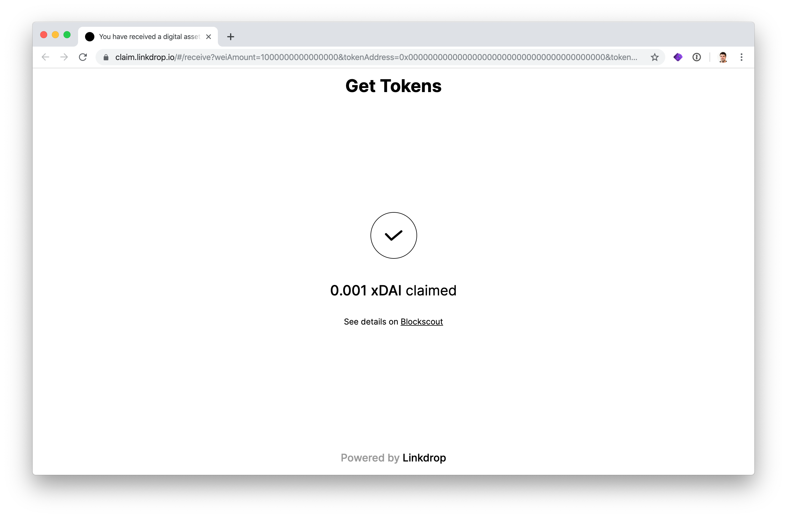
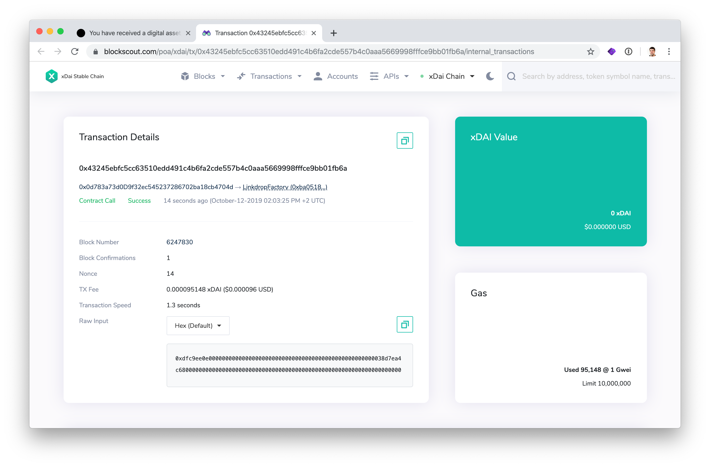

# Getting airdrops via Linkdrop

### Linkdrop links are a simple way to claim an airdrop.


[See this guide if you want to create a linkdrop airdrop](../../for-developers/developer-resources/creating-airdrops/creating-airdrops-via-linkdrop.md).


1\) Connect your web3 wallet \(like MetaMask\) to the account you wish to receive the airdrop with.

2\) Connect to the xDai network \([instructions for connecting with MetaMask](https://app.gitbook.com/@poa/s/news/~/edit/drafts/-Lr9soY3cGJoyhBcqxRg/for-users/wallets-setup/metamask-setup)\). 

3\) Open the link. The format will look similar to the following: 

> https://claim.linkdrop.io/\#/receive?weiAmount=1000000000000000&tokenAddress=0x0000000000000000000000000000000000000000&tokenAmount=0&expirationTime=1900000000000&version=1&chainId=100&linkKey=0xec8ca8fefd48b842b80e630f4f24bbd288feae67c01e438b33787136a2353756&linkdropMasterAddress=0xe8e1af82e2c45ee040d8d2dcc78fbf28fb6cb25b&linkdropSignerSignature=0x28c9683fb584ef7e7d201684fb0d78d9ffde6fb64b1e535673d13ec0add56e3969ea94f64b6f9b1ec6f7bd0c9c652dc624cb4d471ba8132142d6e548bf3eee9c1b&campaignId=12


Note the link above has already been claimed.


4\) Click **Claim** to accept the airdrop.

5\) The claim is successful!

6\) Your transaction is viewable in BlockScout.

