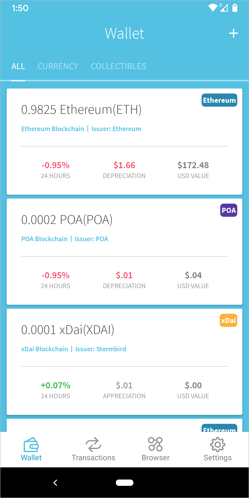

# Importing an existing account to Alpha Wallet

To import an existing account to Alpha:

* a\) Go to **Settings** -&gt; **Change Wallet.**

* b\) Click + .

* c\) Select **Import Wallet.**

* 4\) Add **Method** \(seed, keystore, private key or watch\) & click **Import.**

You will now be connected to this account, and can switch between accounts as needed.

