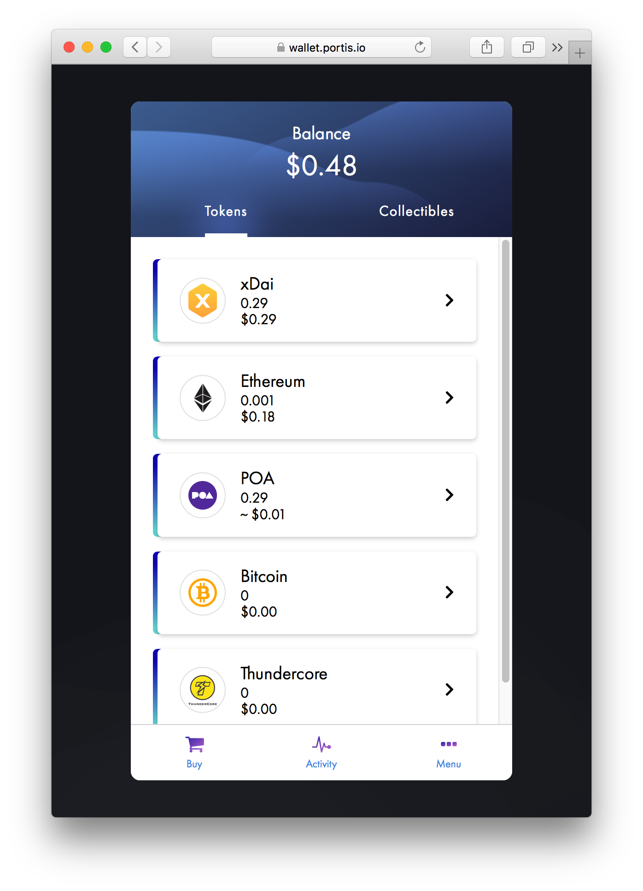

# Portis Wallet

**Wallet Type:** [Web-based wallet](https://www.portis.io/)

**Description**:  Portis allows users to access their wallet and dApps through a web browser with a simple and familiar “email and password” setup. This process **does not require** any third-party installations! A user’s wallet is immediately encrypted on the client side using the email/password combination, and the encrypted wallet is stored on Portis's servers. This gives developers the ability to integrate their dApp builds in a straightforward manner, resulting in less time spent on interface issues, and more time for banging out code and smart contract testing.

Portis supports xDai, Bitcoin, Ethereum and POA tokens.

**Use Cases**: Portis Wallet is more than a simple application for coin and token storage. Rather, it's a usability tool for accessing Web3 applications. Unlike other browser extensions detecting Web3, Portis automatically detects which network the current DApp supports. This makes applications deployed on xDai Stable Chain far more accessible, as the user no longer needs to change RPC networks. Portis does this automatically, removing a major source of confusion for the user!

**What the team says** : _"When xDai went live we were quick to integrate it into Portis and even become an official validator of the network. The POA team helps us realize our vision of onboarding the masses, by letting DApp users pay gas fees with a stablecoin, successfully tackling yet another UX challenge."_ -- **Tom Teman, CEO, and co-founder, Portis**

