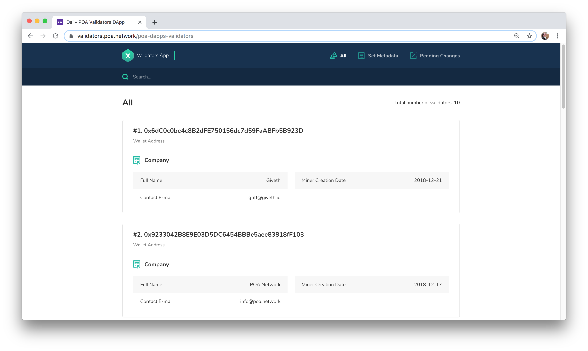

# About xDai Validators


The xDai chain is currently functioning in a permissioned POSDAO-based consensus, where selected validators use xDai-based STAKE tokens to secure the chain. xDai will transition to public POSDAO in the coming months, where community members can become validator candidates as well as delegate STAKE to candidates and validators. 


The xDai Stable Chain is protected by a select group of validators well known in the Ethereum space. [See this post for a list of current validators.](../about-xdai/news-and-information/current-xdai-validators.md)

To learn more about the current validators, [visit our forum section where validators introduce themselves ](https://forum.poa.network/c/xdai-chain/validators-intro)and explain why they want to validate the chain.

