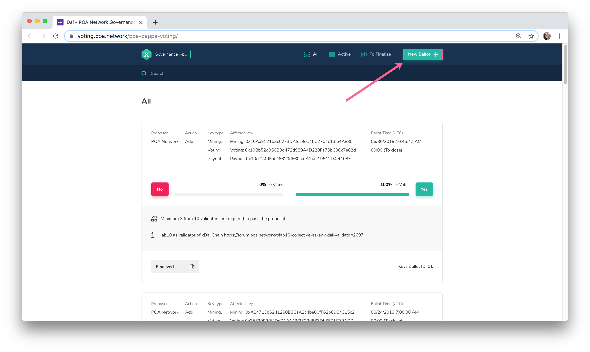
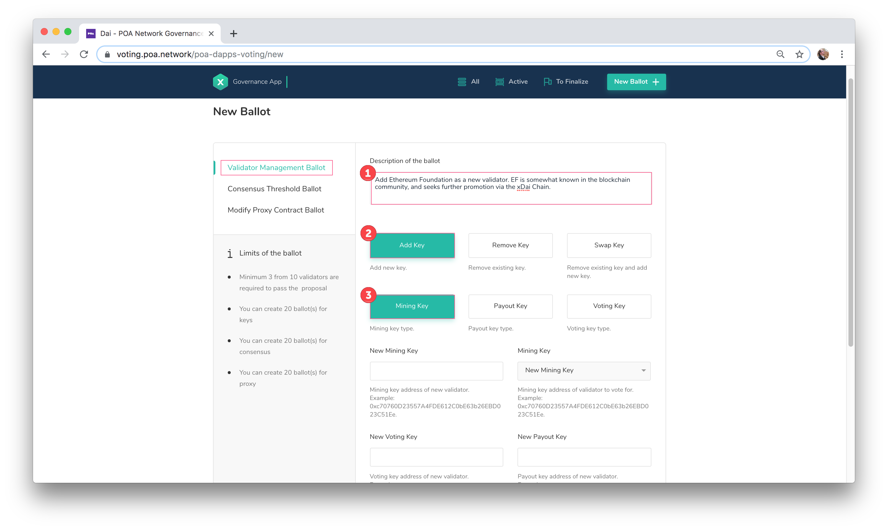
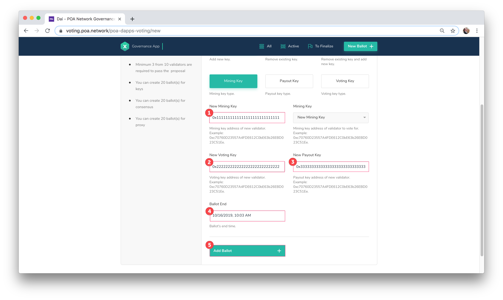
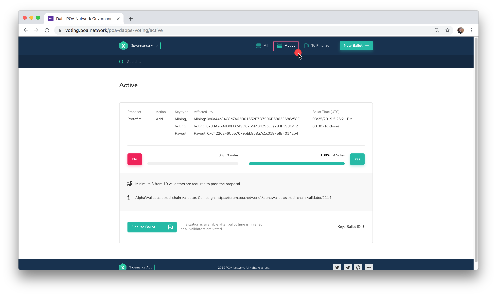

# Current xDai Validators: Ballot Process

Items are numbered according to steps in the [Validator Process Flow](https://docs.xdaichain.com/xdai-for-validators/new-validator-process-flow). Steps 1-4 are undertaken by the validator candidate before the current validators propose a ballot. If a new validator is elected, they will need to [setup their node](https://docs.xdaichain.com/xdai-for-validators/new-validator-process-flow/new-xdai-validator-node-setup) before [finalizing the ballot](https://docs.xdaichain.com/xdai-for-validators/new-validator-process-flow/current-xdai-validators-ballot-process#8-finalize-a-ballot).

##  5. Add a Ballot to Elect a New Validator 

1\) The new candidate should have provided the network-related accounts \(mining key, voting key, payout key\) they have generated in the forum. You will only need account addresses \(0x…\), not private keys or json keystore files.

2\) Connect to the xDai RPC Url \([https://dai.poa.network](https://dai.poa.network/), networkID = 100\) using Nifty wallet or MetaMask and select your VOTING key.

3\) Go to [https://voting.poa.network/poa-dapps-voting/](https://voting.poa.network/poa-dapps-voting/) - you should see an interface similar to this. Click “New Ballot” in the top right.

4\) Validator Management Ballot should be selected by default in the left menu. 

1. Add Ballot Description
2. Select **Add Key**
3. Select **Mining Key**

5\) Scroll down and paste the account addresses provided to you by the candidate. Double check values are correct for each field and match the proper key type.

1. New Mining Key
2. New Voting Key
3. New Payout Key
4. Ballot end date will be auto set to 48 hours. Change if desired, but not that a ballot can only be finalized after the Ballot End time has passed, so don't set too far in the future.
5. Click **Add Ballot** and sign the transaction in MetaMask \(or Nifty Wallet\).

6\) Inform other current validators about the new ballot so that they have a chance to vote before ballot expires. Create a comment in the candidate’s original [forum post](https://forum.poa.network/c/xdai-chain/validators-intro), and notify all validators via the Slack channel.

##  6. Vote on a New Candidate Ballot 

1\) Go to [https://voting.poa.network/poa-dapps-voting/](https://voting.poa.network/poa-dapps-voting/)  and select the **Active** tab to view a list of active ballots.

2\) Locate the ballot you want to cast your vote on. Read the description of the ballot and make sure you understand information about the proposed candidate.

3\) Cast your vote by clicking on either **Yes** or **No** and signing the transaction in MetaMask.

##  7.  \[Optional\] Add Validator to Bridge 

If the new validator is also a bridge validator, add this validator to the bridge \(see Bridge Validators section\)

## 8. Ensure the New Validator's Node is Running 

Before a ballot is finalized, instruct the newly elected validator to [setup their node](https://docs.xdaichain.com/xdai-for-validators/new-validator-process-flow/new-xdai-validator-node-setup). Once this is done and confirmed as properly installed and running, the ballot may be finalized.


Do not proceed to step 9 until new validator's node is confirmed as installed and running properly. 


## 9. Finalize a Ballot 

After the ballot time has expired, **any current validator can finalize the ballot** \(it does not need to be the individual who started the ballot\). Select the **To Finalize** tab in the header and click on **Finalize Ballot**.

The new validator will be added to the validator set. Let them know [in the forum](https://forum.poa.network/c/xdai-chain/validators-intro) that they can create their metadata.

##   

