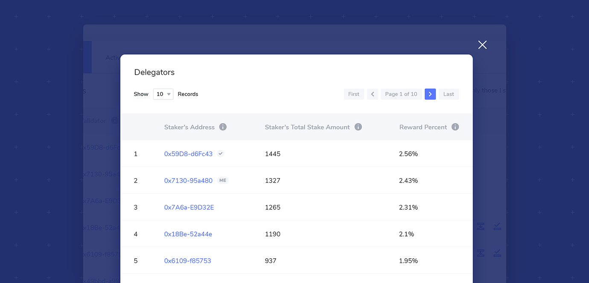

# Become a Delegator


Staking is not here yet, but we are gathering documentation related to xDai staking processes. All pages in this section are currently under construction.


Delegators play an important role in securing the network. By placing stake on candidates, delegators provide additional funds which improve a candidate’s likelihood of becoming a validator. Stake can be thought of as a “vote” in the form of $DPOS tokens for a candidate.

Delegators can place stake on multiple candidates, move stake between active candidates, and order stake withdrawals during a staking epoch. Block rewards for delegators are based on the percentage of stake they place in the pool. While each validator pool receives the same reward during a staking epoch, rewards within a pool are split between the validators and delegators. This split is based on how much stake a delegator has placed relative to the total pool stake \(delegators split up to 70% of the pool. See here for more details on reward distribution\). The reward percent is updated each staking epoch in the Delegators modal, which is accessed by clicking on the number of Delegators for any Pool.

## **Instructions for becoming a delegator**

1\) You will need the minimum candidate stake amount of $DPOS and a small amount of xDAI deposited to your address on the xDai chain. Deposit these to your staking address - this is the address you will use to access the protocol. 

2\) Go to [blockscout.com](http://blockscout.com/) and change the network to the xDai network. .

3\) After you have switched to xDai, select an item from the Stakes dropdown.

4\) Set your web3wallet  account to the address which contains xDai and $DPOS, and set the RPC network in the wallet to xDai. Once connected, you should see your address and $DPOS balance in the site banner.

5\) Find a candidate pool you would like to place stake on. You can view current validator pools on the **Validators Tab**, and all active pools in the **Active Tab**. Click on the pool address to see current pool statistics to help guide your decision. Staking into a candidate with a smaller pool size will result in higher reward percentages, however, candidates with smaller pools have a lower likelihood of selection to the validator set \(assuming 20+ active pools\). Stake on the candidate\(s\) you believe will provide the most benefits for the network, as this will benefit you as well.

6\) Once decided, click the stake icon next to the pool you would like to stake on.

7\) Enter the STAKE amount to stake. The minimum initial stake is `TBD` Click the **Place Stake** button to submit your transaction.

8\) You should see the transaction pop-up for your web3 wallet. Transaction fees do not need to change. Click **submit** to process.

9\) Wait a moment for successful processing. Once confirmed, you will see the Success modal. Click OK.

10\) Your stake will be added to the pool. **It will not be activated until the next staking epoch**. This means you can move or withdraw your stake freely until the staking window closes, which occurs at the end of the current staking epoch.

11\) To view your stake amount and reward percentage, click on the number of delegators. Your address will be marked with **ME**.

12\) If your pool is selected as a validator for the next validator set, your stake will accrue rewards. Rewards are distributed automatically at the very end of an epoch.

13\) While your delegator stake is active \(in use by a current validator pool\), it cannot be moved or withdrawn immediately. However, you can:

1. **Add additional stake**: Any additional stake added during an epoch will not accrue rewards for the current epoch, but will be added to the pool size which will influence selection in the next epoch. If the pool is chosen as a validator again, this added stake will be included in the next epoch’s rewards calculations. 
   * **Instruction** To add additional stake on a candidate or validator, click the stake icon and enter the additional amount. You can add in any increment, as long as the total stake is more than …… Follow the web3 wallet prompts to complete the transaction. 
2. **Order stake for withdrawal**. You may order a withdrawal of your stake, which will then be available at the beginning of the next epoch. Ordering a withdrawal will also influence total pool size for the next epoch’s selection process. To order a withdrawal, click the withdrawal icon and enter the amount to order. You must either keep the minimum delegation stake amount \(…\) OR order the entire amount for withdrawal. You cannot have an amount below the minimum, but you may withdraw your total amount. 
   * **Instruction** Enter the amount and click Order Withdrawal. The transaction should process through the web3 wallet interface. Once the staking epoch is complete, the amount will be available to claim. Click on the claim icon and follow the instructions \(or learn more here\)

