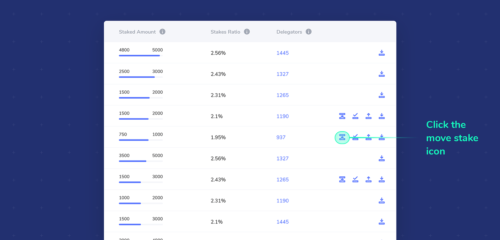
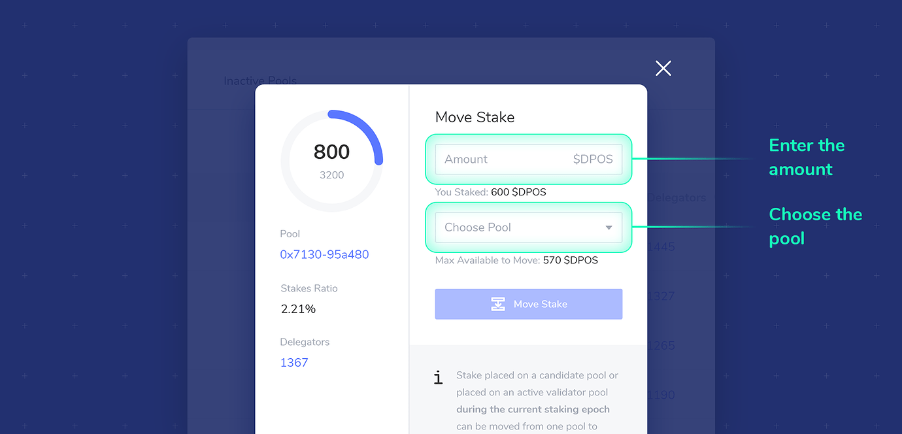
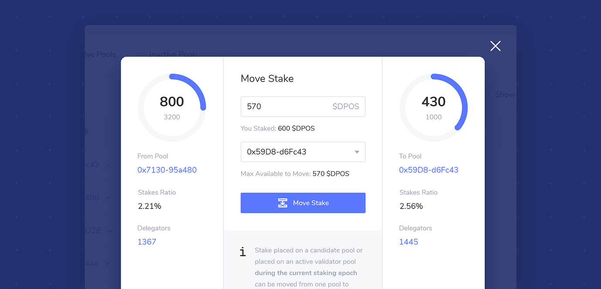

# Move Stake


Staking is not here yet, but we are gathering documentation related to xDai staking processes. All pages in this section are currently under construction.


To change which candidate you are staking on, or spread your stake to different pools, stake can be moved between pools. You must either retain the minimum amount of stake in the pool \(to remain in the pool\), or move the entire amount to exit the pool and shift your stake to a different pool. Stake moved to another pool must also total at least the minimum amount of stake. If you have already staked the minimum amount to a pool, you can move any additional amount to that pool.

**Stake can be moved accordingly:**

* Stake placed on an active candidate pool who is not a validator, or stake placed on an inactive candidate pool can be moved at any time\*
* Stake placed on an active validator pool can be moved **during the same staking epoch in which it was placed**.
* Stake cannot be moved or withdrawn from a banned pool until the ban is complete.


\*Note You cannot add, move or withdraw stake when the staking window is closed. This occurs at the very end and very beginning of each staking epoch, where all staking actions are inactive.


#### To move stake:

1\) Locate the pool you would like to **move stake from**, and click the move stake icon. This icon will only appear if moving stake is a current option.

2\) Enter the amount to move, and choose the pool to move the stake to in the dropdown menu.

3\) When you select the pool to move to, the modal will display information about that pool on the right side.

4\) To proceed, click the **Move Stake** button. Confirm the transaction through the web3 wallet interface.

5\) Once the transaction is complete, stake will be immediately removed from the current pool and placed in the selected pool.

6\) Moved stake is considered pending until the end of the current staking epoch. It can be moved an unlimited number of times until the staking window is close

