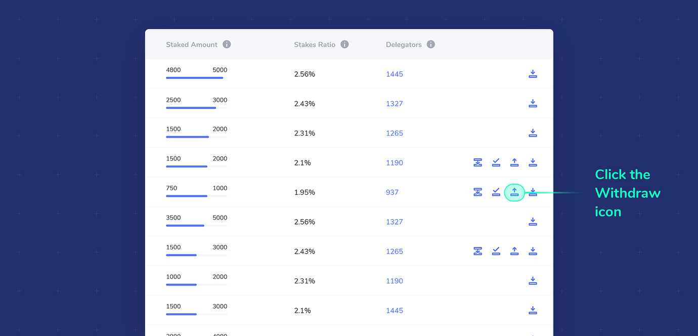

# Withdraw Stake


Staking is not here yet, but we are gathering documentation related to xDai staking processes. All pages in this section are currently under construction.


Stake can be withdrawn from a pool and deposited back to your web3 wallet address. You can withdraw the entire amount to exit a pool, or withdraw a portion as long as the minimum required stake remains in the pool. Funds are either available for immediate withdraw or ordered withdrawal depending on the circumstances.

#### Immediate withdrawal:

* Stake placed on an active candidate pool that is not a validator, or an inactive pool, is available to withdraw at any time\*
* Stake placed on an active validator pool can be withdrawn **during the same staking epoch in which it was placed.**
* Stake cannot be withdrawn from a banned pool until the ban is complete.

#### Ordered withdrawal:

* Active stake, in use by a current validator pool, can be ordered for withdrawal. This order is processed at the end of the current staking epoch, and available to claim in the subsequent staking epoch.
* The amount of stake ordered for withdrawal may be increased or decreased **during the same staking epoch in which it was placed**.


\*_**Note:**_ _You cannot add, move or withdraw stake when the staking window is closed. This occurs at the very end and very beginning of each staking epoch, where all staking actions are inactive._


### Immediate Withdrawal Instructions \(Withdraw Now\):

1\) Check that your [web3 wallet is connected with the correct address](https://forum.poa.network/t/staking-with-a-web3-wallet-metamask-nifty-wallet/2995) and you have enough [xDai](https://forum.poa.network/t/acquire-dpos-and-xdai/2994) to process the transaction.

2\) Click the Withdraw icon next to the pool you would like to withdraw from. The icon will only appear if a withdrawal of some type is possible.

3\) Enter the amount to withdraw. The maximum amount you can withdraw is shown next to Available now: _\(See Order Withdrawal Instructions below if you only see Available after the current epoch\)_. You can withdraw the entire amount to leave the pool, or withdraw any amount up to the minimum amount required to stay in the pool.

4\) Click the **Withdraw Now** button and follow the web3 wallet prompts to confirm the transaction.

5\) Once the transaction is processed, the withdrawn amount will be immediately reflected in your balance.

### Ordered Withdrawal Instructions

1\) Check that your [web3 wallet is connected with the correct address](https://forum.poa.network/t/staking-with-a-web3-wallet-metamask-nifty-wallet/2995) and you have enough [xDai](https://forum.poa.network/t/acquire-dpos-and-xdai/2994) to process the transaction.

2\) Click the Withdraw icon next to the active validator pool you would like to withdraw from. The icon will only appear if a withdrawal of some type is possible.

3\) Enter the amount to order. If an order is available, you will see the amount you staked and the **Amount Available after the current epoch**. You can order the entire amount to exit the pool at the end of the staking epoch, or order any amount to withdraw up to the minimum amount required to stay in the pool.

4\) Click the **Order Withdrawal** button and follow the web3 wallet prompts to confirm the transaction.

5\) Once you have placed an order, you can **adjust the amount ordered during the current staking epoch**. Open the withdrawal icon and you will see your staked amount, the total amount available, and a new **already ordered** item, which will show the amount previously entered in step 3.

1. To order an additional amount to withdraw, follow steps 3 and 4 to complete an additional transaction, adding this amount to your previous order.
2. To **reduce the amount ordered, enter a - in front of the number**. For example, if you have already ordered 5, but want to reduce that to 3, enter -2 in the amount field. This will adjust the order to 3.

6\) The order will process at the end of the staking epoch, and your funds will be available to claim. If you ordered your entire stake from the pool, you will no longer be a delegator with that pool

