# xDai Validators

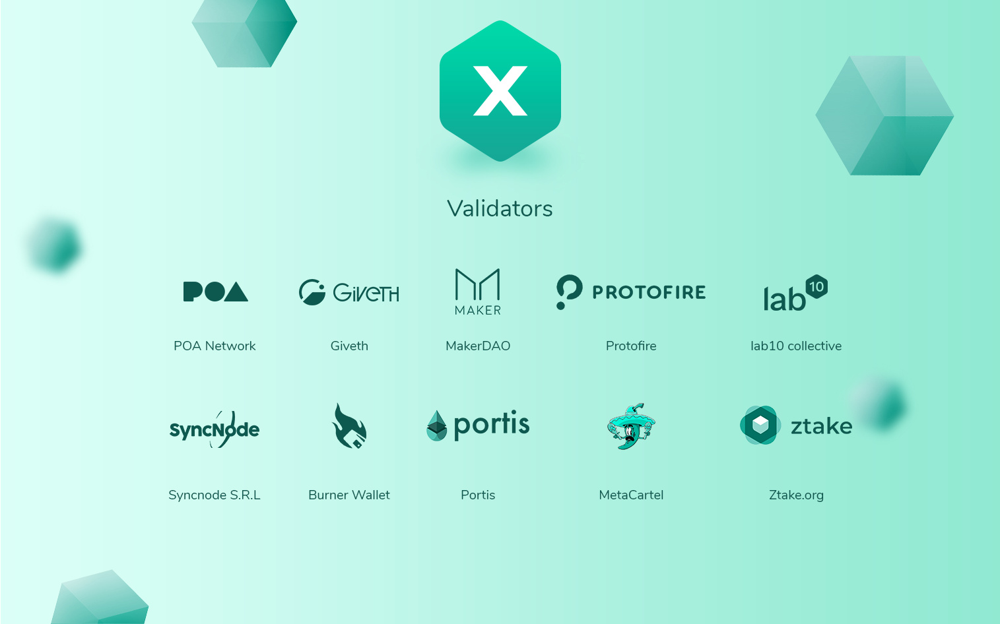

In our recent [history of xDai](https://forum.poa.network/t/xdai-the-birth-of-the-stable-chain/2812) post, we discussed the origins of the xDai Stable Chain. When it began, xDai was highly centralized - in fact POA Network was the one and only validator! This immediately shifted as several new validators were introduced, and POA Network’s on-chain governance model brought further decentralization to the protocol.

A set of [on-chain governance tools](https://voting.poa.network) allows current validators to propose and elect new validators as they see fit. Validator candidates introduce themselves and make their case for becoming a new validator, the current validators discuss their merits and ask questions, and if they decide to proceed, a vote is proposed to add the new validator to the protocol. Over the past year, 9 new validators have been added to the xDai Stable chain, bringing the total to 10 validators responsible for securing the chain.

xDai stable chain validators have multiple responsibilities, including providing secure transactional consensus and managing network decisions. When DAI from Ethereum is bridged to xDAI and back, a subset of validators ensure these transactions are conducted properly and securely in a non-custodial, decentralized fashion.

As we prepare to upgrade the xDai Stable Chain to the new [POSDAO](https://forum.poa.network/t/posdao-white-paper/2208) consensus model, the current xDai validators will become the initial staking validators for this delegated Proof-of-Stake model. Their nodes are currently optimized for the protocol, and their experience providing consensus will be invaluable at the start. Any individual who holds **$DPOS** may stake and delegate on these validators. Once the chain is up and running, additional entities may establish their own nodes and register as new validator candidates according to the rules of the protocol.

Following the first staking epoch, which will last one week \(each staking epoch is one week in length\), a new validator set will be selected. Validator candidates with the largest pools \(consisting of their own stake + stake from any delegators\) will have a higher chance of selection to the next epoch. Validator set selection occurs for each new staking epoch.

The xDai stable chain upgrade to POSDAO consensus is designed to achieve [greater decentralization](https://xdaichain.com/). With this upgrade, two tokens will be connected through interoperability bridges. The xDai token will continue as the native stable coin, and **$DPOS** will be added as the multichain staking token. **$DPOS** will first be available for staking on the xDai stable chain, but it will also function across multiple networks. Each time a new xDai-based chain is created and established, the **$DPOS** token will be used for staking. The introduction of multiple tokens, along with delegated Proof-of-Stake consensus, promotes further decentralization and censorship resistance on the xDai chain.

The [ten current validators](https://forum.poa.network/c/xdai-chain/validators-intro) of the xDai stable chain are introduced below:

### [POA Network](http://www.poa.network)

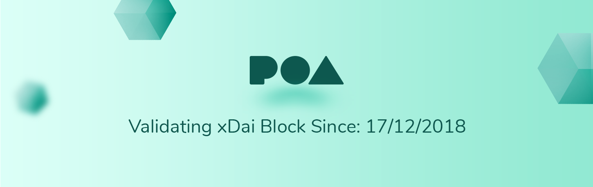

As the Master of Ceremony of the xDai Stable Chain, POA Network is the first validator and the network initiator. POA Network builds infrastructure and tools for the Ethereum ecosystem focused on both users and developers. With the xDai Stable Chain, POA Network has created a peer-to-peer payment solution on Ethereum that is easy, fast, predictable, and extremely inexpensive. _“We created xDai as a stablecoin-based blockchain to open up endless possibilities for developers and applications. With the introduction of_ [_POSDAO_](https://forum.poa.network/t/posdao-white-paper/2208) _consensus we are adding a higher level of decentralization to xDai and introducing multichain staking on Ethereum”_ -- [**Igor Barinov**](https://twitter.com/barinov)**, Tech Lead of POA Network.**

### [MakerDAO](https://makerdao.com)

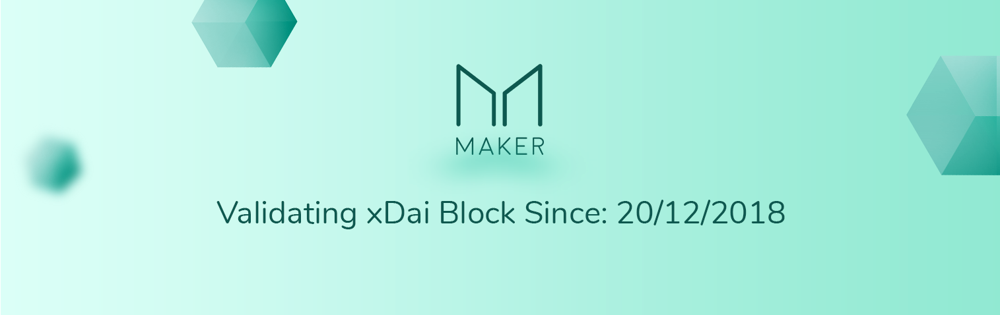

MakerDAO is an autonomous blockchain organization that offers a decentralized stablecoin to minimize market volatility. Its stablecoin, Dai, is pegged to the U.S. Dollar and is backed by Ethereum collateral. _“MakerDAO was one of the first xDai Validators because we believe in the value of a blockchain where the underlying token is Dai, providing stable and predictable prices for its gas use. In addition, the xDai chain has given birth to some amazing projects such as the Burner Wallet, which we've seen first hand can be used to onboard and delight new users to Ethereum. We look forward to seeing further adoption in the future.”_ [**Mariano Conti**](https://twitter.com/nanexcool) **- Head of Smart Contracts**. In addition to Dai, MakerDAO has issued Maker \(MKR\) tokens which are used to govern the ongoing initiatives within the MakerDAO organization.

### [Protofire](https://protofire.io)

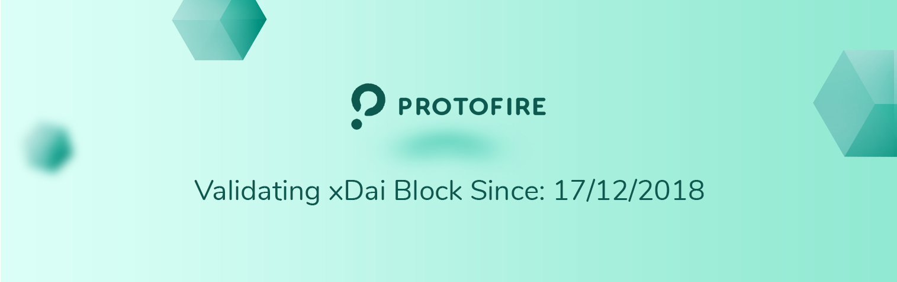

Protofire is a team of engineers who deliver decentralized infrastructure, protocols and applications to accelerate the growth of blockchain ecosystems. By delivering hands-on coding and contributions, Protofire specializes in supercharging developer adoption and network usage. _“Protofire has been involved in the POA Networks ecosystem for a long time, contributing to its technology stack development. When the xDAI Network was born around DevCon IV, it was a no brainer for us to contribute to it as both network and bridge validators. At Protofire we believe that combining a stablecoin such as MakerDAO DAI with a scalable side chain, which provides not only higher speed but mainly low and stable cost fees, is a perfect match to enable and optimize many use cases, from digital cash in emerging economies to supply chain and non-speculative decentralized finance.”_ -- [**Manuel Garcia**](https://twitter.com/rmgarciap)**, CTO at Protofire.**

### [Giveth](http://giveth.io)

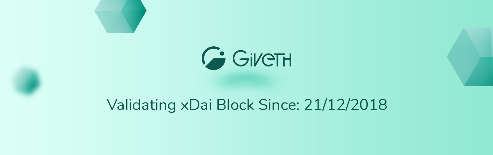

Giveth is a community of blockchain enthusiasts who strive to make the world a better place via the use of blockchain technology. They organize under the Giveth Galaxy which fosters a large network of organizations to build the vision they strive to achieve. As one of the early validators of xDai, Giveth has been involved with the on-boarding of new validators throughout 2019. _“xDAI is pushing Scaling NOW! Everyone talks about Scaling Ethereum... eventually, but POA Network actually did it with xDai and we are so happy to be one of the initial validators of xDai Stable Chain”_ -- [**Griff Green**](https://twitter.com/thegrifft)**, founder of Giveth**. _“People forget this, but xDAI is a DAO, the validators vote for upgrades and hard forks, we vote on whether or not to accept new validators, it has been one of the most successful governance experiments I have been a part of"_.

### [Burner Wallet](http://xdai.com)

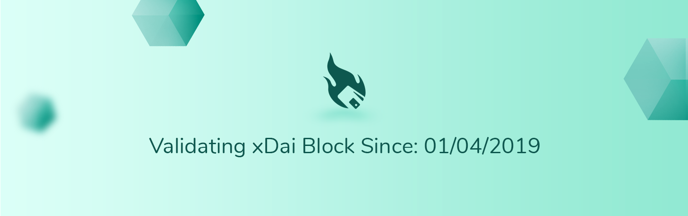

Created by Austin Griffith in November 2018, the Burner Wallet provides a quick and easy way to carry and exchange small amounts of spending crypto using a mobile browser. The Burner Wallet runs on the xDai Chain and uses xDai, taking advantage of low fees and fast transaction times. Austin Griffith, the creator of Burner Wallet has bigger plans for Burner Wallet and xDai for 2019: _“As an xDai validator I’m excited to experiment with new mechanisms in staking and because I’m focusing on_ [_building games on top_](https://forum.poa.network/t/daog-an-open-ended-decentralized-governance-game/2599) _of the Burner Wallet, an on-chain random number generator will really help out."_ - [**Austin Griffith**](https://twitter.com/austingriffith)**, creator of Burner Wallet.**

### [Portis](http://portis.io)

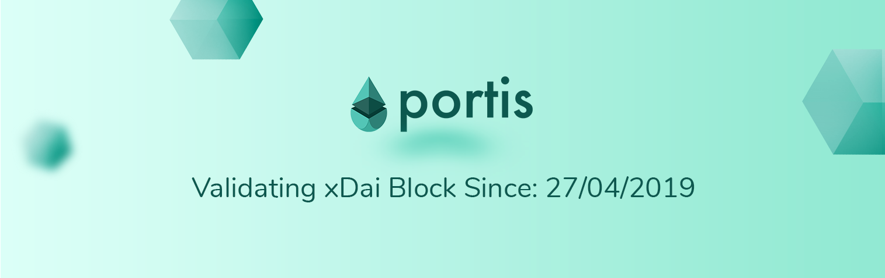

Portis is a technology company that wants to make sure any person in the world can use decentralized applications, just as easily as they use "regular" apps. Crafting simple user interactions is at the heart of what they are building. As one of the early supporters of xDai, Portis quickly [applied to be one of the validators](https://forum.poa.network/c/xdai-chain/validators-intro) of the chain in order to bring more decentralization to the network. _“The POA team is a major driver of mainstream adoption, that's why we were thrilled to be the first web3 provider to officially support it \(besides the POA in-house Nifty Wallet\), back in September 2018._

_When they released xDai we were quick to integrate it into Portis and even become an official validator of the network. The POA team helps us realize our vision of onboarding the masses, by letting DApp users pay gas fees with a stablecoin, successfully tackling yet another UX challenge.”_ - [**Tom Teman**](https://twitter.com/tomteman) **- Portis Co-founder & CEO.**

### Syncnode

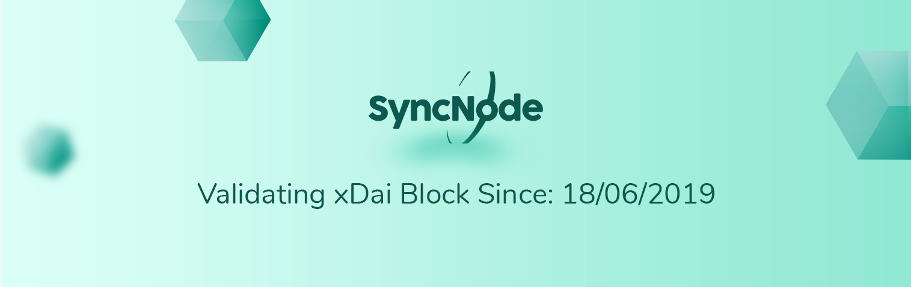

Syncnode is a software development company with a global presence and headquarters in Switzerland and Romania. Since 2017 Syncnode has been fully dedicated to the blockchain space where they are involved in building solutions and communities. _“I joined xDai because I am a big fan of Dai as stable coin and combined with a fast blockchain it will bring a lot of value to the blockchain ecosystem and will push adoption forward”_ -- [**George Bunea**](https://twitter.com/syncn0de?lang=en)**, founder of Syncnode.**

### [MetaCartel](https://metacartel.org)

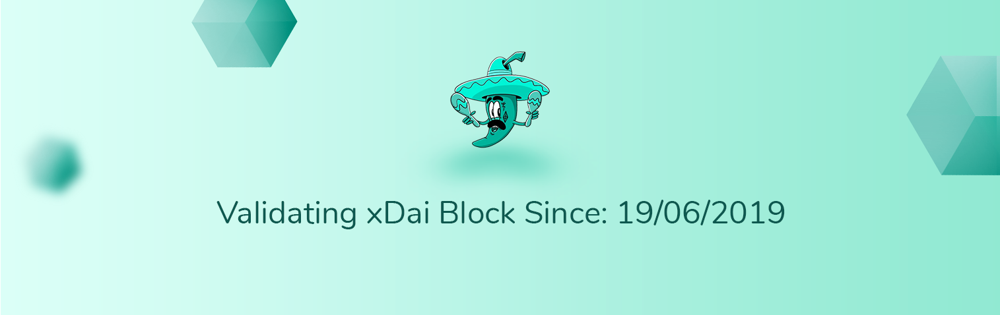

MetaCartel is a community of projects in the Ethereum space that works on coordinating shared infrastructure and ecosystem efforts. Working on an ecosystem of projects that are based around Web3.0, MetaCartel are working on a DAO to fund experimentation around usability and UX advancements as well as new web 3.0 technology use cases. “_xDAI is a great platform to build quick and lean DApp experiments as it allows you to abstract out the complexities of gas management so you can focus on product market fit._

_Focus is key with discovering product success and the less distractions the better.”_ -- [**Pet3rpan**](https://twitter.com/pet3rpan_) **- Senior Social Media manager of MetaCartel**. They are also working on launching DAOs with various communities \(Yang DAO, Kitty DAO, etc.\) and innovating on the user experience of DAOs.

### [Ztake.org](http://ztake.org)

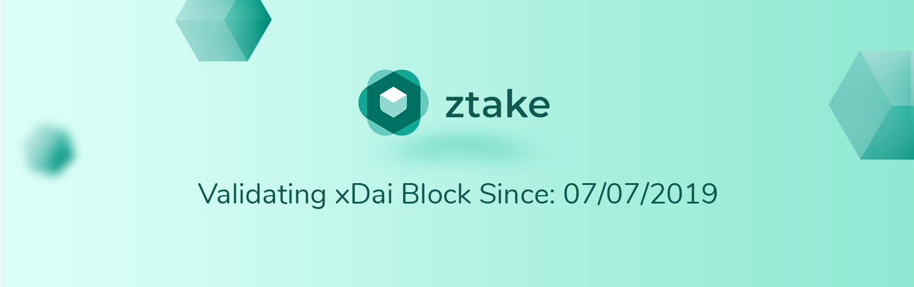

Ztake.org are made up tech-savvy blockchain developers and enthusiasts who run nodes on PoS and PoA blockchains. Ztake.org have a proven track record as infrastructure operators for PoA and PoS networks and have been supporting xDai before [applying as validators](https://forum.poa.network/t/ztake-org-as-an-xdai-validator/2680) _“We find the 2019 roadmap for POA and xDai quite exciting and can't wait till the new multichain staking mechanism goes live.”_ -- [**Mira Nugumanova**](https://twitter.com/ztake_org)**, founder of Ztake.org** _“This will be a first-of-its-kind experiment in the Proof of Stake space, it is technically hard to implement but could be very successful if done right.”_

### [lab10 collective](https://lab10.coop/en/)

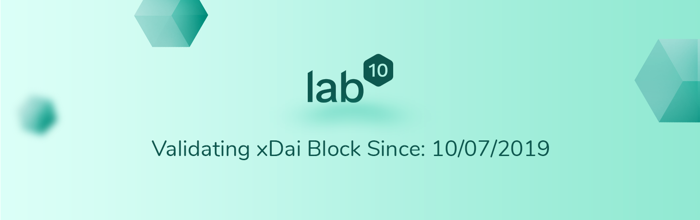

lab10 collective is a cooperative dedicated to co-create a zero-carbon society. It builds sustainable blockchain enabled energy and mobility solutions towards an open, fair and ethical sharing economy. _"My first encounter with xDai was a transfer via Burner Wallet onto my mobile phone and I immediately liked the simplicity and speed of it. It is great to be part of this well known group of validators to secure the xDai sidechain and push the limits for staking and consensus algorithms."_ -- [**Thomas Zeinzinger**](https://twitter.com/tze42)**, Boardmember of the lab10 collective.**

The xDai Stable Chain is widely acknowledged by the community as an immediately available scaling solution and peer-to-peer payment platform. The POSDAO update will provide additional decentralization, and present the opportunity for many more individuals to become involved in the consensus process through delegated staking.

The ten validators highlighted above will serve as the initial validators when the network transitions to the POSDAO model. Community delegators will be able to participate by placing stake on these validators. We are extremely excited for delegated and multichain staking, and look forward to the positive changes and innovations it brings to the ecosystem as a whole!

In our next post, we will explore the xDai infrastructure starting with the wallets that currently support xDai. Wallets are a key user interface, and they address real world problems and unique use cases on the xDai stable chain. We will discuss features, functionality, and what you can expect from supported wallets with the POSDAO upgrade.

## Connect with xDai Communities:

| Community | Link |
| :--- | :--- |
| Twitter | [https://twitter.com/xdaichain](https://twitter.com/xdaichain) |
| Telegram Announcements | [https://t.me/xdai\_official](https://t.me/xdai_official) |
| Telegram Public Chat | [https://t.me/xdaistable](https://t.me/xdaistable) |
| Discord | [https://discord.gg/HmffjbF](https://discord.gg/HmffjbF) |

