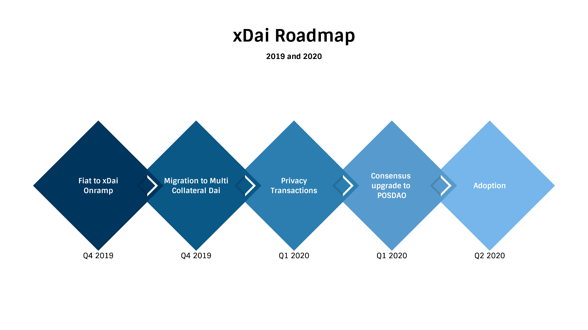

# Roadmap

## Fiat to xDai Onramp

**Target Date:** Q4 2020 

At the moment, to get xDai, most users have to get Dai first and relay it to xDai via xDai Bridge. The process is complicated and time-consuming due to congestions on the Ethereum networks and the probabilistic nature of Proof of Work consensus. Relayers of the xDai bridge are waiting for eight blocks on Ethereum before they relay Dai to xDai. 

The xDai team is working with payment processing companies to enable Fiat to xDai onramp. To facilitate the integration of xDai fiat onramp into wallets, the team started "xDai Adoption Fund" [https://www.xdaichain.com/for-developers/grants\#xdai-adoption-fund](https://www.xdaichain.com/for-developers/grants#xdai-adoption-fund)

## Consensus Upgrade

**Target Date:** Q1 2020 

xDai currently uses known organizations in the ecosystem as chain validators. These organizations subsidize their own nodes, and this is unsustainable in the long term. To increase decentralization, and offer the broader community the chance to participate in consensus, we will upgrade to the POSDAO consensus model in the near future. 

## **Privacy preserving transactions**

**Target Date:** Q4 2019

Implementation of additional zero-knowledge protocols and private transactions into xDai. 

Since xDai is a stable token, the primary use of the chain is peer-to-peer payments. Just as with cash, privacy should be an option when exchanging money or paying vendors for services. It doesn’t matter if you are sending money to a relative or your local butcher. You should have the freedom to choose that any transaction remain anonymous.

We have invested in several [different approaches ](https://forum.poa.network/t/introducing-the-poa-zero-knowledge-fund/2698)to implement different ZK protocols into xDai based applications and wallets.

## **Multi-Collateral Dai &lt;-&gt; xDai Bridge**

**Target Date:** Q4 2019 \(based on MakerDAO progress\)

Once the Dai protocol implementation is upgraded to MCD \(Multi-Collateral Dai\), the xDai bridge will also be upgraded to use MCD Dai.

