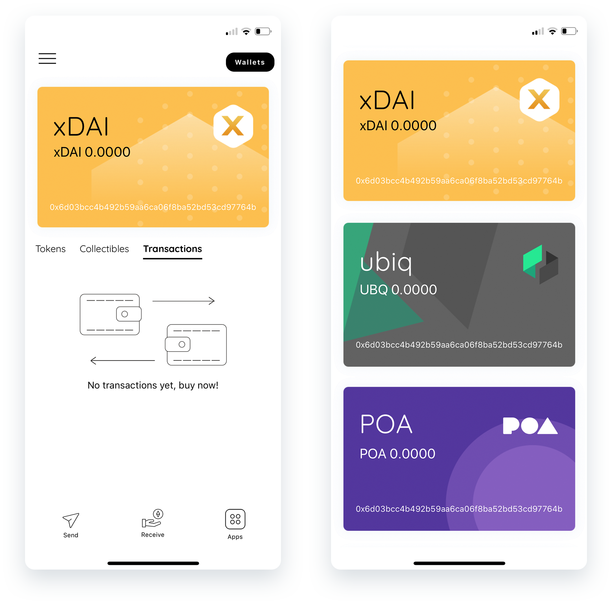

# DEX Wallet

**Wallet Type:** Mobile [iOs wallet](https://itunes.apple.com/us/app/dexwallet/id1434816150?ls=1&mt=8).

**Description**: DexWallet is a secure, multi-chain, mobile wallet with an upcoming one-click exchange feature for mobile. Users are always in control of their assets, and added features make this wallet a very secure option: users keep their own private keys which are only stored locally and protected by encryption and biometric authentication technology.

**Use Cases**:  While DEX Wallet acts primarily as an Ethereum based wallet, it has also integrated various **DeFi protocols**. Using DEX Wallet, users can interact with decentralized finance protocols like **Compound Finance, Maker DAO, Uniswap, DyDx** and more directly within the interface. With the Compound integration, users can supply DAI, ZRX, BAT, WETH and earn interest immediately on the wallet.

**What the team says** : _"We believe that xDai Chain opens up avenues for real use cases that are essential within a local economy. By having a USD stable coin and predictable USD gas costs within a network, we’re able to operate in a high performance state, executing transactions in merely seconds and resulting in a quick and seamless user experience._" _-- \*Alessio Delmonti - Founder of DEX Wallet._

