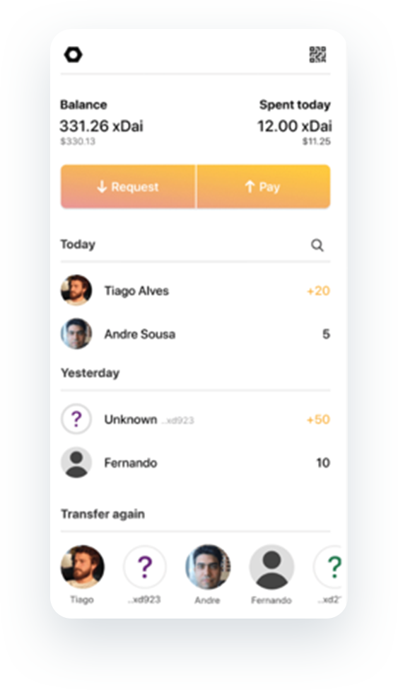

# Poketto

**Wallet Type:** Mobile Wallet

**Description:** Poketto Wallet is the first xDai mobile wallet, available for both [**iOS**](https://apps.apple.com/us/app/poketto-cash/id1460141974) and [**Android**](https://play.google.com/store/apps/details?id=com.poketto.poketto). Featuring a beautiful UI and a smooth user experience, Poketto users can pay for everyday items and send money to friends almost instantaneously. Poketto wallet is the [first recipient](https://forum.poa.network/t/introducing-the-poa-zero-knowledge-fund/2698) of the xDai Privacy Fund grant, which designates funds for organizations implementing anonymous transaction functionality within the xDai ecosystem. By experimenting with the [AZTEC Protocol](https://blog.donesunday.com/post/poketto/integrating-private-transactions), Poketto is moving towards implementing Zero Knowledge proofs in their wallet and enabling anonymous payment options for users. 

**Use Cases**: Poketto wallet is designed with simplicity in mind. It is designed and developed for the everyday person. As their tagline states, Poketto is “A wallet that you can actually show to your parents”. xDai’s primary use is peer-to-peer payment, and with Poketto built on top of it, the two work together to create an easy way for everyone to send money between each other.

**What the team says:** _“We’re building Poketto on xDai because it provides the speed, security, low fees and stability required to develop a universal daily wallet easy enough for anyone to use. It’s the best option for anyone looking to build their dapp with efficiency in mind. In order for Poketto to really become a replacement to the traditional wallet for everyday transactions, we need to provide a way for transactions to remain anonymous. This is why integrating the AZTEC protocol into xDai is crucial to achieve that goal. ” - **Tiago Alvez, Poketto Wallet Founder**_

