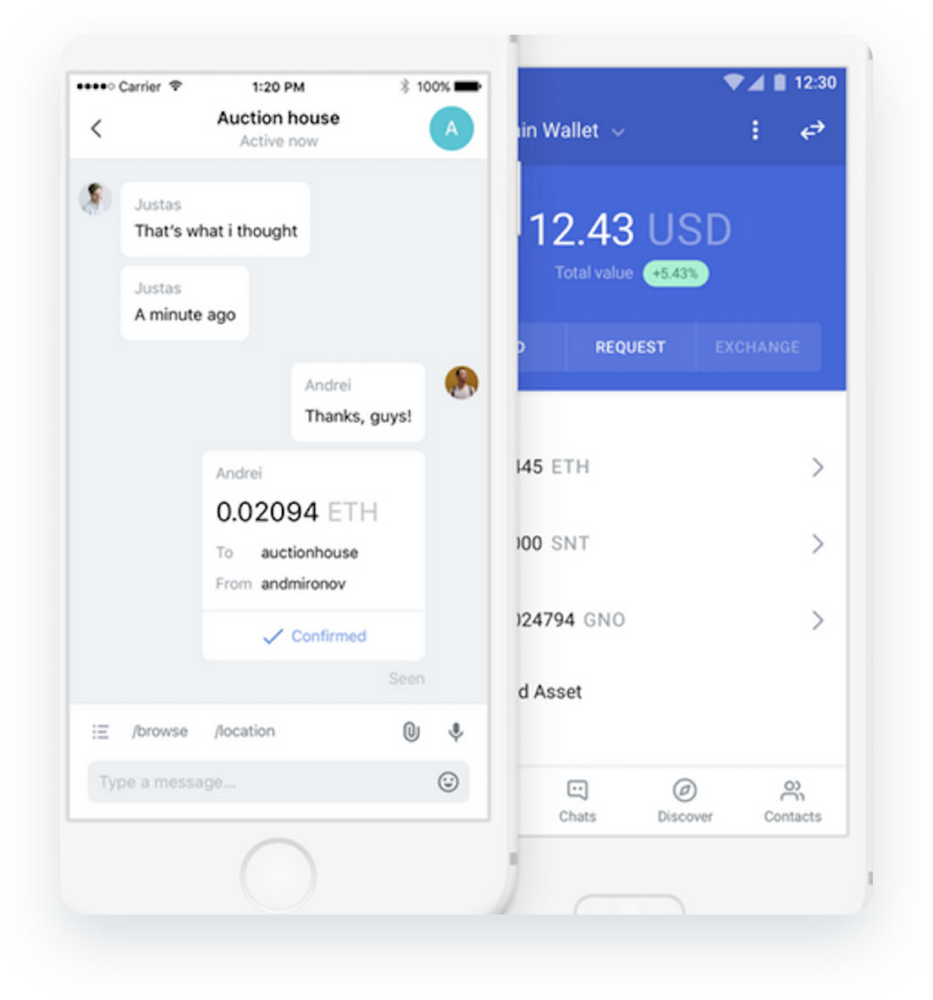

# Status Wallet

**Wallet Type:** Mobile messenger and wallet application available on [**iOs 4**](https://testflight.apple.com/join/J8EuJmey) and [**Android 3**](https://play.google.com/store/apps/details?id=im.status.ethereum).

**Description**: Status is a mobile Ethereum OS that gives users the power to chat, transact, and access a world of DApps on the decentralized web. As a mobile wallet, Status has been supporting xDai Stable Chain since xDai’s launch on October 2018. Users can store their xDai on the wallet, and also transact and exchange with other users and friends through the messaging application built into Status.

**Use Cases**: The Status wallet is designed to support secure and private communications, and provides a gateway to the decentralized web. Their chat application gives users the ability to send secure messages along with xDai transactions directly through the wallet interface. They also provide a curated DApp explorer which allows for easy search and discovery of useful applications.

Status is actively developing some awesome new features that will increase the utility and use cases for their wallet. These include:

* **Keycard integration**: provides the ability to use a smart card for multi-currency storage and transaction verification.
* **ENS usernames**: Hexadecimal wallet addresses are converted to easy to read names. This will improve communication across accounts.
* **Multi-account support**: Expanding the ability for multiple identities within a wallet to each hold multiple accounts.
* **Teller network integration**: A search application for finding fiat-crypto exchange opportunities with individuals in your area.

**What the team says** : _“One of the long term goals of Status is the mass adoption of distributed technology. A primary challenge we face in achieving this goal is a simple and intuitive user experience. Seamless, fast, and cheap transactions are crucial to a good UX and xDAI is a great example of how this is possible.”_ - **Nabil Naghdy - COO of Status**

